`EGRET`
=======

Exploration and Graphics for RivEr Trends (`EGRET`): An R-package for the analysis of long-term changes in water quality and streamflow, including the water-quality method Weighted Regressions on Time, Discharge, and Season (WRTDS).

Please visit the wiki for more information: [EGRET Wiki](https://github.com/USGS-R/EGRET/wiki)

The link for the official USGS publication user guide is here:

<https://pubs.usgs.gov/tm/04/a10/>

### Current build tests:

| Linux                                                                                                 | Windows                                                                                                                                       |
|-------------------------------------------------------------------------------------------------------|-----------------------------------------------------------------------------------------------------------------------------------------------|
| [](https://travis-ci.org/USGS-R/EGRET) | [](https://ci.appveyor.com/project/ldecicco-USGS/EGRET) |

### Current CRAN information:

| Version                                                                                                | Monthly Downloads                                                                       | Total Downloads                                                                                     |
|--------------------------------------------------------------------------------------------------------|-----------------------------------------------------------------------------------------|-----------------------------------------------------------------------------------------------------|
| [](https://cran.r-project.org/package=EGRET) | [](https://cran.r-project.org/package=EGRET) | [](https://cran.r-project.org/package=EGRET) |

### Research software impact:

[](http://depsy.org/package/r/EGRET)

Package Installation
--------------------

To install the EGRET package, you must be using R 3.0 or greater and run the following command:

``` r
install.packages("EGRET")
```

    ## package 'EGRET' successfully unpacked and MD5 sums checked
    ## 
    ## The downloaded binary packages are in
    ##  C:\Users\lcarr\AppData\Local\Temp\1\RtmpAPk7Z0\downloaded_packages

To get inter-CRAN release updates, use the command:

``` r
install.packages("EGRET",repos="https://owi.usgs.gov/R")
```

    ## package 'EGRET' successfully unpacked and MD5 sums checked
    ## 
    ## The downloaded binary packages are in
    ##  C:\Users\lcarr\AppData\Local\Temp\1\RtmpAPk7Z0\downloaded_packages

To get cutting-edge changes, install from GitHub using the `devtools` packages:

``` r
library(devtools)
install_github("USGS-R/EGRET")
```

    ## Downloading GitHub repo USGS-R/EGRET@master
    ## from URL https://api.github.com/repos/USGS-R/EGRET/zipball/master

    ## Installing EGRET

    ## "C:/Users/lcarr/DOCUME~1/R/R-34~1.0PA/bin/x64/R" --no-site-file  \
    ##   --no-environ --no-save --no-restore --quiet CMD INSTALL  \
    ##   "C:/Users/lcarr/AppData/Local/Temp/1/RtmpAPk7Z0/devtools16881e757ea8/USGS-R-EGRET-bfdd30c"  \
    ##   --library="C:/Users/lcarr/Documents/R/R-3.4.0patched/library"  \
    ##   --install-tests

    ## 

### Reporting bugs

Please consider reporting any bugs or asking general questions to the Issues page:

<https://github.com/USGS-R/EGRET/issues>

Follow `@USGS-R` on Twitter for updates on all USGS R packages: <https://twitter.com/USGS_R>

### Subscribe

Please email questions, comments, and feedback to: <egret_comments@usgs.gov>

Additionally, to subscribe to an email list concerning updates to these R packages, please send a request to <egret_comments@usgs.gov>.

Background:
-----------

Evaluating long-term changes in river conditions (water quality and discharge) is an important use of hydrologic data. To carry out such evaluations, the hydrologist needs tools to facilitate several key steps in the process: acquiring the data records from a variety of sources, structuring it in ways that facilitate the analysis, routines that will process the data to extract information about changes that may be happening, and graphical techniques that can display findings about change. The R package `EGRET` (Exploration and Graphics for RivEr Trends) was developed for carrying out each of these steps in an integrated manner. It is designed to accept easily data from three sources: U.S. Geological Survey hydrologic data, Water Quality Portal Data (currently including U.S. Environmental Protection Agency (EPA) STORET data, and USDA STEWARDS data), and user-supplied flat files. The `EGRET` package has components oriented towards the description of long-term changes in streamflow statistics (high flow, average flow, and low flow) as well as changes in water quality. For the water-quality analysis, it uses Weighted Regressions on Time, Discharge and Season (WRTDS) to describe long-term trends in both concentration and flux. `EGRET` also creates a wide range of graphical presentations of the water-quality data and of the WRTDS results. The following report serves as a user guide, providing detailed guidance on installation and use of the software, documentation of the analysis methods used, as well as guidance on some of the kinds of questions and approaches that the software can facilitate.

`EGRET` includes statistics and graphics for streamflow history, water quality trends, and the statistical modeling algorithm Weighted Regressions on Time, Discharge, and Season (WRTDS). Please see the official EGRET User Guide for more information on the `EGRET` package:

<https://dx.doi.org/10.3133/tm4A10>

The best ways to learn about the WRTDS approach is to read the User Guide and two journal articles. These articles are available, for free, from the journals in which they were published. The first relates to nitrate and total phosphorus data for 9 rivers draining to Chesapeake Bay. The URL is:

<http://onlinelibrary.wiley.com/doi/10.1111/j.1752-1688.2010.00482.x/full>.

The second is an application to nitrate data for 8 monitoring sites on the Mississippi River or its major tributaries. The URL is:

<http://pubs.acs.org/doi/abs/10.1021/es201221s>

Note to users of earlier versions of `EGRET`
--------------------------------------------

Note: As of February 5, 2015 a new version of the user guide has been posted at the URL given above. If you were using previous versions of EGRET you should take a look [here](https://github.com/USGS-R/EGRET/wiki/Note-to-users-of-earlier-versions-of-EGRET) to see a list of the major changes in the workflow and some function names.

Sample Workflow
---------------

### Load data from web services

``` r
library(EGRET)
Daily <- readNWISDaily("06934500","00060","1979-10-01","2010-09-30")
```

    ## There are 11323 data points, and 11323 days.

``` r
Sample <-readNWISSample("06934500","00631","1970-10-01","2011-09-30")
INFO <-readNWISInfo("06934500","00631", interactive=FALSE)

eList <-mergeReport(INFO, Daily, Sample)
```

    ## 
    ##  Discharge Record is 11323 days long, which is 31 years
    ##  First day of the discharge record is 1979-10-01 and last day is 2010-09-30
    ##  The water quality record has 440 samples
    ##  The first sample is from 1979-09-26 and the last sample is from 2011-09-29
    ##  WE HAVE A PROBLEM first sample is from before the first daily discharge
    ##  WE HAVE A PROBLEM last sample is from after the last daily discharge
    ##  Discharge: Minimum, mean and maximum 394 2650 20900
    ##  Concentration: Minimum, mean and maximum 0.02 1.3 4.2
    ##  Percentage of the sample values that are censored is 1.4 %

    ## Some Sample dates do not have corresponding flow data. Not all EGRET functions will work correctly.

### Sample workflow for using WRTDS on the Choptank River at Greensboro MD, for Nitrate

``` r
library(EGRET)

############################
# Gather discharge data:
siteID <- "01491000" #Choptank River at Greensboro, MD
startDate <- "" #Gets earliest date
endDate <- "2011-09-30"
# Gather sample data:
parameter_cd<-"00631" #5 digit USGS code
Sample <- readNWISSample(siteID,parameter_cd,startDate,endDate)
#Gets earliest date from Sample record:
#This is just one of many ways to assure the Daily record
#spans the Sample record
startDate <- min(as.character(Sample$Date)) 
# Gather discharge data:
Daily <- readNWISDaily(siteID,"00060",startDate,endDate)
```

    ## There are 13998 data points, and 13998 days.

``` r
# Gather site and parameter information:

# Here user must input some values for
# the default (interactive=TRUE)
INFO<- readNWISInfo(siteID,parameter_cd)
```

    ## Your site for streamflow data is:
    ##  01491000 .
    ## Your site name is CHOPTANK RIVER NEAR GREENSBORO, MD 
    ## but you can modify this to a short name in a style you prefer. 
    ## This name will be used to label graphs and tables. 
    ## If you want the program to use the name given above, just do a carriage return,
    ## otherwise enter the preferred short name(no quotes):
    ## 
    ## The latitude and longitude of the site are:  38.99719 ,  -75.78581 (degrees north and west).
    ## 
    ## The drainage area at this site is  113 square miles
    ##  which is being stored as 292.6687 square kilometers.
    ## 
    ## It is helpful to set up a station abbreviation when doing multi-site studies,
    ## enter a unique id (three or four characters should work). It is case sensitive.  
    ## Even if you don't feel you need an abbreviation for your site you need to enter something(no quotes):
    ## 
    ## Your water quality data are for parameter number:
    ## 00631 
    ## which has the name:' Nitrate plus nitrite, water, filtered, milligrams per liter as nitrogen '.
    ## Typically you will want a shorter name to be used in graphs and tables.
    ## The suggested short name is:' Inorganic nitrogen (nitrate and nitrite) '.
    ## If you would like to change the short name, enter it here, 
    ## otherwise just hit enter (no quotes):
    ## The units for the water quality data are:  mg/l as N .
    ## It is helpful to set up a constiuent abbreviation, enter a unique id 
    ## three or four characters should work something like tn or tp or NO3).
    ## Even if you don't feel you need an abbreviation you need to enter something (no quotes):

``` r
INFO$shortName <- "Choptank River at Greensboro, MD"

# Merge discharge with sample data:
eList <- mergeReport(INFO, Daily, Sample)
```

    ## 
    ##  Discharge Record is 13998 days long, which is 38 years
    ##  First day of the discharge record is 1973-06-04 and last day is 2011-09-30
    ##  The water quality record has 655 samples
    ##  The first sample is from 1973-06-04 and the last sample is from 2011-09-29
    ##  Discharge: Minimum, mean and maximum 0.00991 4.08 246
    ##  Concentration: Minimum, mean and maximum 0.05 1.1 2.4
    ##  Percentage of the sample values that are censored is 0.15 %

``` r
############################

############################
# Check sample data:
boxConcMonth(eList)
```

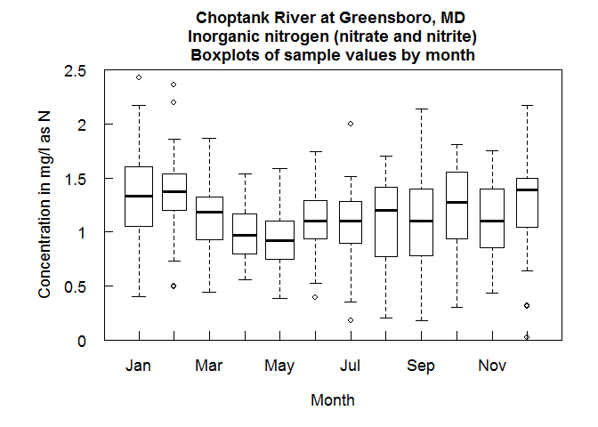

``` r
boxQTwice(eList)
```

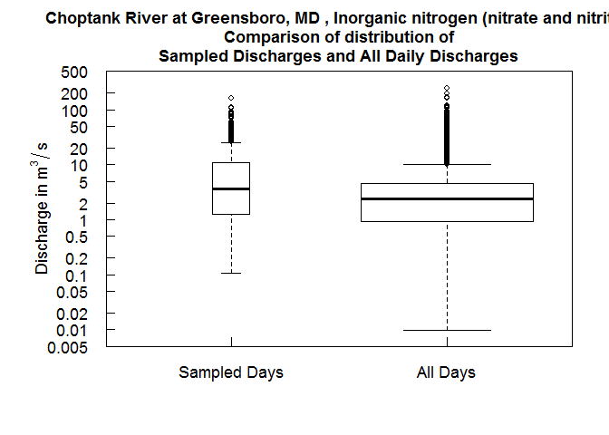

``` r
plotConcTime(eList)
```

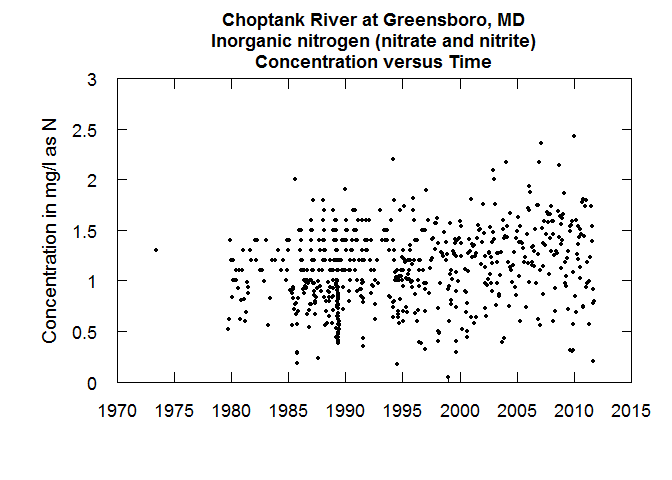

``` r
plotConcQ(eList)
```

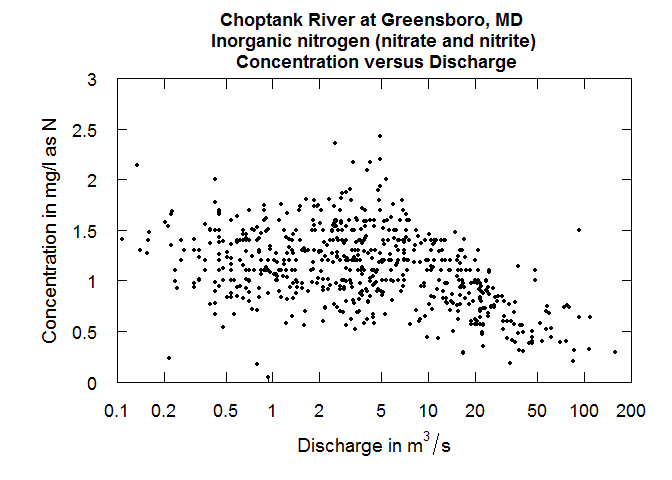

``` r
multiPlotDataOverview(eList)
```

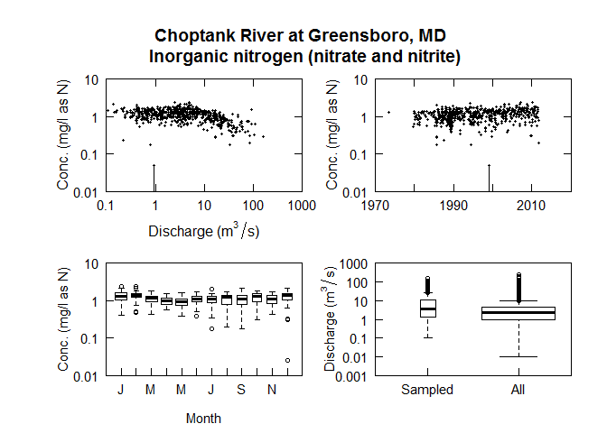

``` r
############################

############################
# Run WRTDS model:
eList <- modelEstimation(eList)
```

    ## 
    ##  first step running estCrossVal may take about 1 minute
    ##  estCrossVal % complete:
    ## 0    1   2   3   4   5   6   7   8   9   10  
    ## 11   12  13  14  15  16  17  18  19  20  
    ## 21   22  23  24  25  26  27  28  29  30  
    ## 31   32  33  34  35  36  37  38  39  40  
    ## 41   42  43  44  45  46  47  48  49  50  
    ## 51   52  53  54  55  56  57  58  59  60  
    ## 61   62  63  64  65  66  67  68  69  70  
    ## 71   72  73  74  75  76  77  78  79  80  
    ## 81   82  83  84  85  86  87  88  89  90  
    ## 91   92  93  94  95  96  97  98  99  
    ## Next step running  estSurfaces with survival regression:
    ## Survival regression (% complete):
    ## 0    1   2   3   4   5   6   7   8   9   10  
    ## 11   12  13  14  15  16  17  18  19  20  
    ## 21   22  23  24  25  26  27  28  29  30  
    ## 31   32  33  34  35  36  37  38  39  40  
    ## 41   42  43  44  45  46  47  48  49  50  
    ## 51   52  53  54  55  56  57  58  59  60  
    ## 61   62  63  64  65  66  67  68  69  70  
    ## 71   72  73  74  75  76  77  78  79  80  
    ## 81   82  83  84  85  86  87  88  89  90  
    ## 91   92  93  94  95  96  97  98  99  
    ## Survival regression: Done

``` r
############################

############################
#Check model results:

#eList:
plotConcTimeDaily(eList)
```

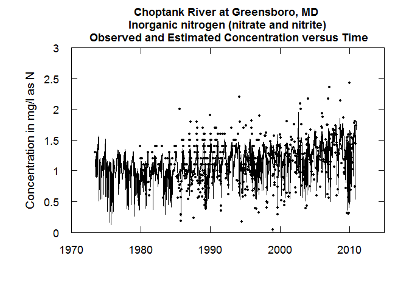

``` r
plotFluxTimeDaily(eList)
```

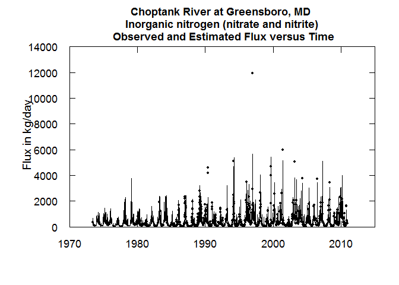

``` r
plotConcPred(eList)
```

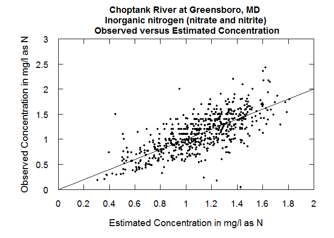

``` r
plotFluxPred(eList)
```

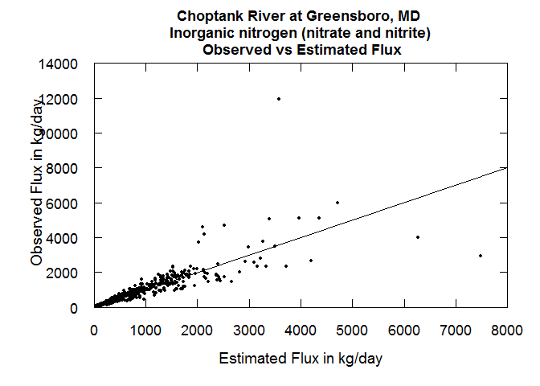

``` r
plotResidPred(eList)
```

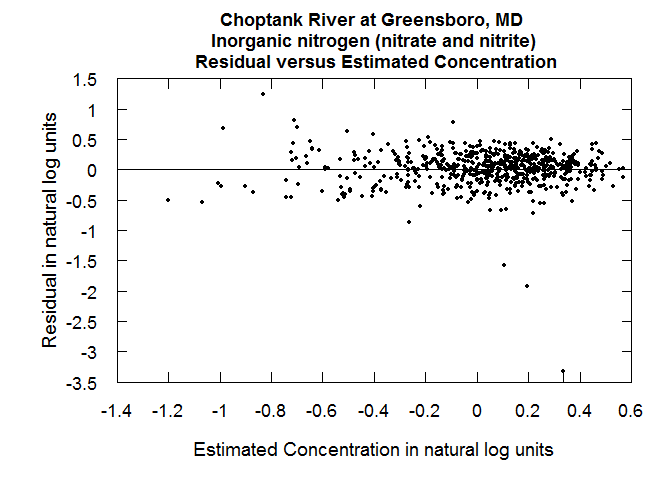

``` r
plotResidQ(eList)
```

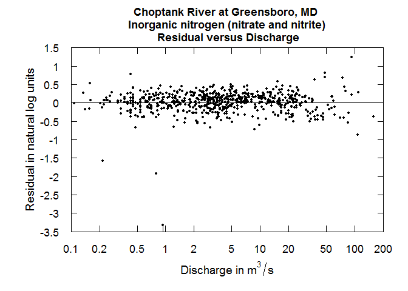

``` r
plotResidTime(eList)
```

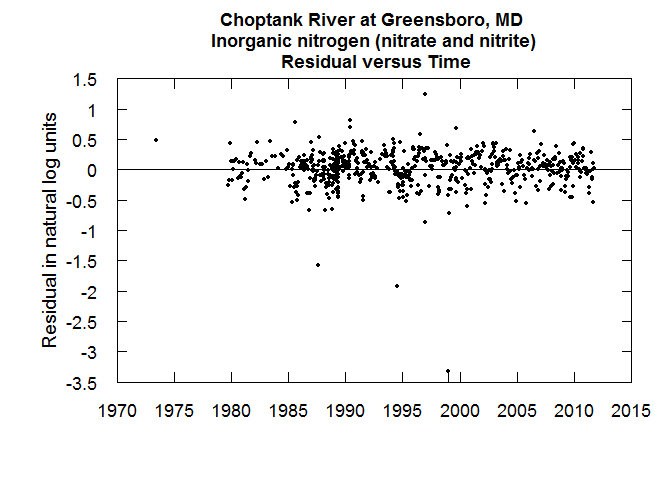

``` r
boxResidMonth(eList)
```

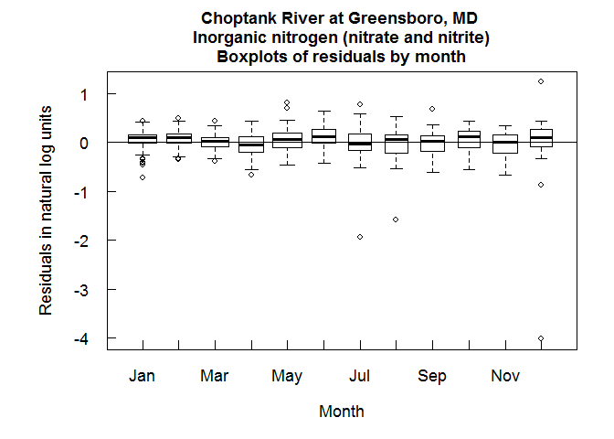

``` r
boxConcThree(eList)
```

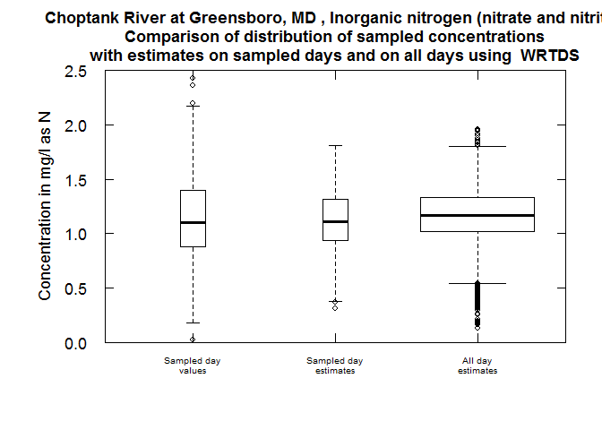

``` r
#Require Daily + INFO:
plotConcHist(eList)
```

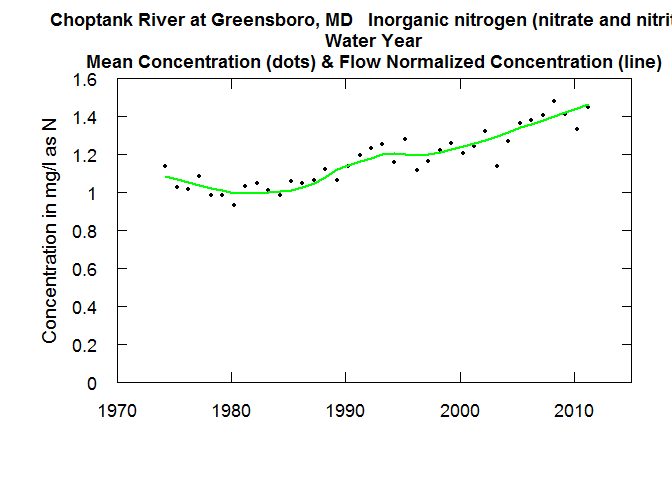

``` r
plotFluxHist(eList)
```

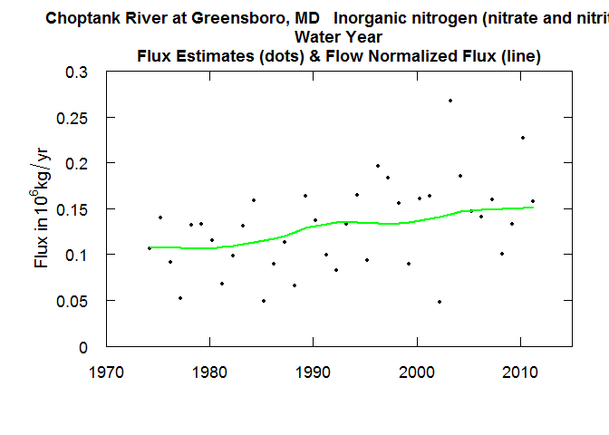

``` r
# Multi-line plots:
date1 <- "2000-09-01"
date2 <- "2005-09-01"
date3 <- "2009-09-01"
qBottom<-100
qTop<-5000
plotConcQSmooth(eList, date1, date2, date3, qBottom, qTop, 
                   concMax=2,qUnit=1)
```

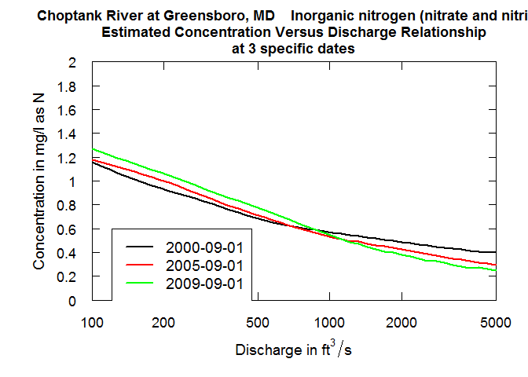

``` r
q1 <- 10
q2 <- 25
q3 <- 75
centerDate <- "07-01"
yearEnd <- 2009
yearStart <- 2000
plotConcTimeSmooth(eList, q1, q2, q3, centerDate, yearStart, yearEnd)
```

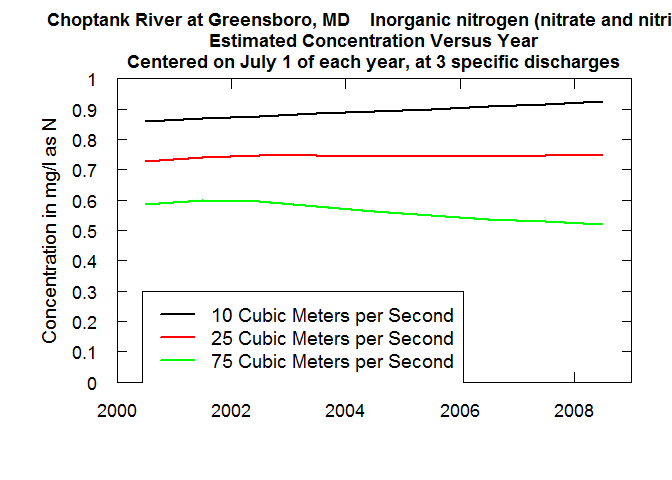

``` r
# Multi-plots:
fluxBiasMulti(eList)
```

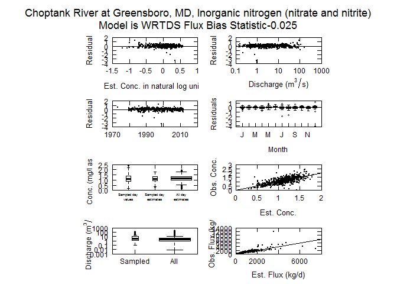

``` r
#Contour plots:
clevel<-seq(0,2,0.5)
maxDiff<-0.8
yearStart <- 2000
yearEnd <- 2010

plotContours(eList, yearStart,yearEnd,qBottom,qTop, 
             contourLevels = clevel,qUnit=1)
```

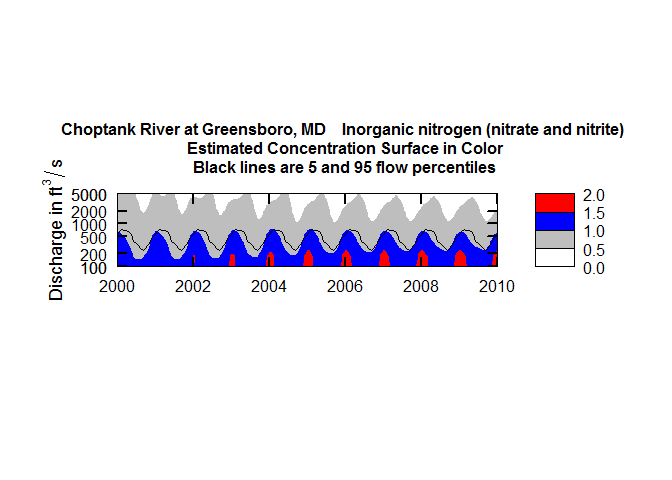

``` r
plotDiffContours(eList, yearStart,yearEnd,
                 qBottom,qTop,maxDiff,qUnit=1)
```

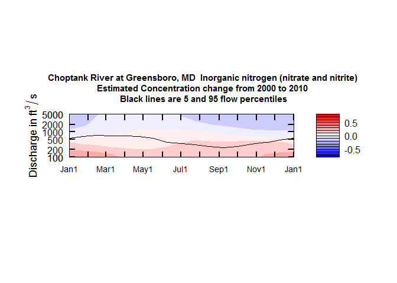

``` r
# modify this for your own computer file structure
savePath<-"/Users/rhirsch/Desktop/" 
saveResults(savePath)
```

### Sample workflow for a flowHistory application for the entire record

``` r
library(EGRET)

# Flow history analysis
############################
# Gather discharge data:
siteID <- "01491000" #Choptank River at Greensboro, MD
startDate <- "" # Get earliest date
endDate <- "" # Get latest date
Daily <- readNWISDaily(siteID,"00060",startDate,endDate)
```

    ## There are 25379 data points, and 25379 days.

``` r
# Gather site and parameter information:
# Here user must input some values for
# the default (interactive=TRUE)
INFO<- readNWISInfo(siteID,"00060")
```

    ## Your site for streamflow data is:
    ##  01491000 .
    ## Your site name is CHOPTANK RIVER NEAR GREENSBORO, MD 
    ## but you can modify this to a short name in a style you prefer. 
    ## This name will be used to label graphs and tables. 
    ## If you want the program to use the name given above, just do a carriage return,
    ## otherwise enter the preferred short name(no quotes):
    ## 
    ## The latitude and longitude of the site are:  38.99719 ,  -75.78581 (degrees north and west).
    ## 
    ## The drainage area at this site is  113 square miles
    ##  which is being stored as 292.6687 square kilometers.
    ## 
    ## It is helpful to set up a station abbreviation when doing multi-site studies,
    ## enter a unique id (three or four characters should work). It is case sensitive.  
    ## Even if you don't feel you need an abbreviation for your site you need to enter something(no quotes):
    ## 
    ## Your water quality data are for parameter number:
    ## 00060 
    ## which has the name:' Discharge, cubic feet per second '.
    ## Typically you will want a shorter name to be used in graphs and tables.
    ## The suggested short name is:' Stream flow, mean. daily '.
    ## If you would like to change the short name, enter it here, 
    ## otherwise just hit enter (no quotes):
    ## The units for the water quality data are:  ft3/s .
    ## It is helpful to set up a constiuent abbreviation, enter a unique id 
    ## three or four characters should work something like tn or tp or NO3).
    ## Even if you don't feel you need an abbreviation you need to enter something (no quotes):
    ## 
    ## Required concentration units are mg/l. 
    ## The INFO dataframe indicates: ft3/s 
    ## Flux calculations will be wrong if units are not consistent.

``` r
INFO$shortName <- "Choptank River at Greensboro, MD"
eList <- as.egret(INFO, Daily, NA, NA)
############################

############################
# Check flow history data:
plotFlowSingle(eList, istat=7,qUnit="thousandCfs")
```

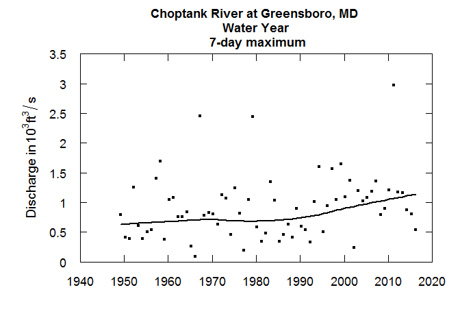

``` r
plotSDLogQ(eList)
```

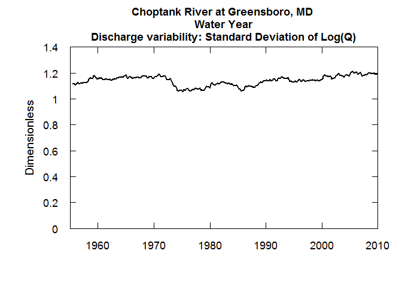

``` r
plotQTimeDaily(eList, qLower=1,qUnit=3)
```

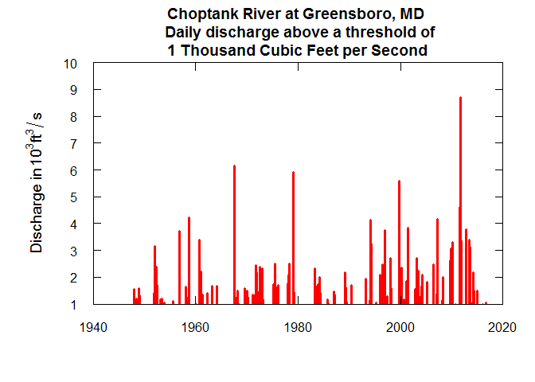

``` r
plotFour(eList, qUnit=3)
```

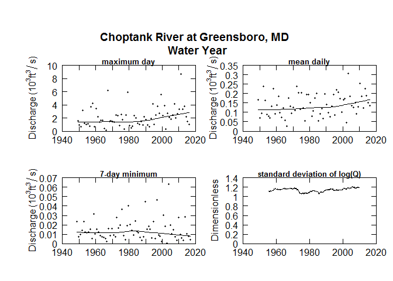

``` r
plotFourStats(eList, qUnit=3)
```


``` r
############################
```

``` r
# modify this for your own computer file structure:
savePath<-"/Users/rhirsch/Desktop/" 

saveResults(savePath, eList)
```

Disclaimer
----------

This software is in the public domain because it contains materials that originally came from the U.S. Geological Survey (USGS), an agency of the United States Department of Interior. For more information, see the official USGS copyright policy at <https://www.usgs.gov/visual-id/credit_usgs.html#copyright>

Although this software program has been used by the USGS, no warranty, expressed or implied, is made by the USGS or the U.S. Government as to the accuracy and functioning of the program and related program material nor shall the fact of distribution constitute any such warranty, and no responsibility is assumed by the USGS in connection therewith.

This software is provided "AS IS."

[](http://creativecommons.org/publicdomain/zero/1.0/)
