# EGRET 

[](https://github.com/USGS-R/EGRET/actions)
[](https://codecov.io/gh/USGS-R/EGRET)
[](https://owi.usgs.gov/R/packages.html#research)
[](https://cran.r-project.org/package=EGRET)
[](https://cran.r-project.org/package=EGRET)
[](https://cran.r-project.org/package=EGRET)

Exploration and Graphics for RivEr Trends (`EGRET`): An R-package for
the analysis of long-term changes in water quality and streamflow,
including the water-quality method Weighted Regressions on Time,
Discharge, and Season (WRTDS).

The link for the official USGS publication user guide is here:

<https://pubs.usgs.gov/tm/04/a10/>

A companion package [`EGRETci`](https://usgs-r.github.io/EGRETci/)
implements a set of approaches to the analysis of uncertainty associated
with WRTDS trend analysis.

If you are familiar with the traditional `EGRET` workflow, check out the
[Overview and
Updates](https://usgs-r.github.io/EGRET/articles/Overview.html) to see
how all the latest updates relate.

## Package Installation

To install the EGRET package, you must be using R 3.0 or greater and run
the following command:

``` r
install.packages("EGRET")
```

## Background:

Evaluating long-term changes in river conditions (water quality and
discharge) is an important use of hydrologic data. To carry out such
evaluations, the hydrologist needs tools to facilitate several key steps
in the process: acquiring the data records from a variety of sources,
structuring it in ways that facilitate the analysis, routines that will
process the data to extract information about changes that may be
happening, and graphical techniques that can display findings about
change. The R package `EGRET` (Exploration and Graphics for RivEr
Trends) was developed for carrying out each of these steps in an
integrated manner. It is designed to accept easily data from three
sources: U.S. Geological Survey hydrologic data, Water Quality Portal
Data (currently including U.S. Environmental Protection Agency (EPA)
STORET data, and USDA STEWARDS data), and user-supplied flat files. The
`EGRET` package has components oriented towards the description of
long-term changes in streamflow statistics (high flow, average flow, and
low flow) as well as changes in water quality. For the water-quality
analysis, it uses Weighted Regressions on Time, Discharge and Season
(WRTDS) to describe long-term trends in both concentration and flux.
`EGRET` also creates a wide range of graphical presentations of the
water-quality data and of the WRTDS results. The following report serves
as a user guide, providing detailed guidance on installation and use of
the software, documentation of the analysis methods used, as well as
guidance on some of the kinds of questions and approaches that the
software can facilitate.

`EGRET` includes statistics and graphics for streamflow history, water
quality trends, and the statistical modeling algorithm Weighted
Regressions on Time, Discharge, and Season (WRTDS). Please see the
official EGRET User Guide for more information on the `EGRET` package:

<https://doi.org/10.3133/tm4A10> The best ways to learn about the WRTDS
approach is to read the User Guide and two journal articles. These
articles are available, for free, from the journals in which they were
published. The first relates to nitrate and total phosphorus data for 9
rivers draining to Chesapeake Bay. The URL is:

<https://onlinelibrary.wiley.com/doi/full/10.1111/j.1752-1688.2010.00482.x>.

The second is an application to nitrate data for 8 monitoring sites on
the Mississippi River or its major tributaries. The URL is:

<https://pubs.acs.org/doi/abs/10.1021/es201221s>

For a thorough discussion of the generalized flow normalization method
implemented in the EGRET enhancements, see the paper: “Tracking changes
in nutrient delivery to western Lake Erie: Approaches to compensate for
variability and trends in streamflow”:

(<https://www.sciencedirect.com/science/article/pii/S0380133018302235>).

## Sample Workflow

WRTDS on the Choptank River at Greensboro MD, for Nitrate:

``` r
library(EGRET)

############################
# Gather discharge data:
siteID <- "01491000" #Choptank River at Greensboro, MD
startDate <- "" #Gets earliest date
endDate <- "2011-09-30"
# Gather sample data:
parameter_cd<-"00631" #5 digit USGS code
Sample <- readNWISSample(siteID,parameter_cd,startDate,endDate)
#Gets earliest date from Sample record:
#This is just one of many ways to assure the Daily record
#spans the Sample record
startDate <- min(as.character(Sample$Date)) 
# Gather discharge data:
Daily <- readNWISDaily(siteID,"00060",startDate,endDate)
# Gather site and parameter information:

# Here user must input some values for
# the default (interactive=TRUE)
INFO<- readNWISInfo(siteID,parameter_cd)
INFO$shortName <- "Choptank River at Greensboro, MD"

# Merge discharge with sample data:
eList <- mergeReport(INFO, Daily, Sample)
```

``` r
library(EGRET)
# Sample data included in package:
eList <- Choptank_eList

boxConcMonth(eList)
```

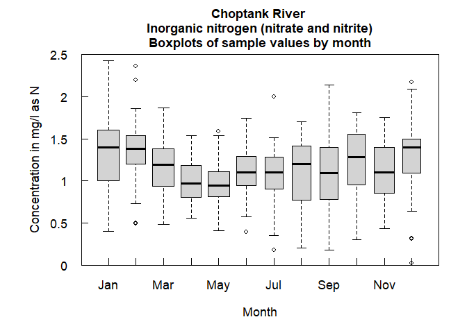

``` r
boxQTwice(eList)
```

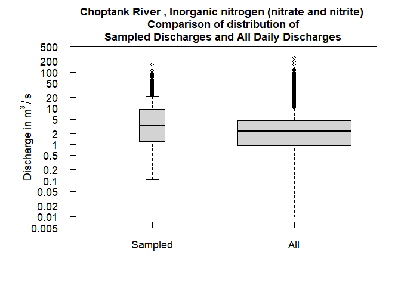

``` r
plotConcTime(eList)
```


``` r
plotConcQ(eList)
```


``` r
multiPlotDataOverview(eList)
```

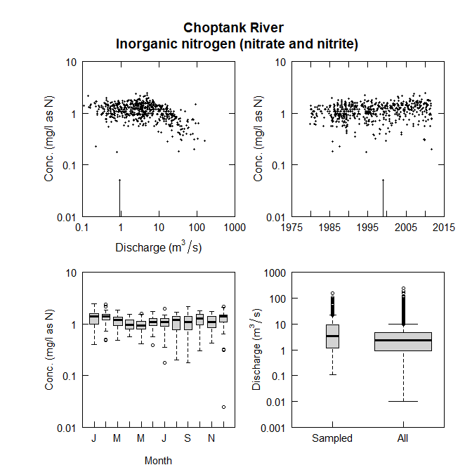

``` r
# Run WRTDS model:
eList <- modelEstimation(eList)
#> 
#>  first step running estCrossVal may take about 1 minute
#>  estCrossVal % complete:
#> 0    1   2   3   4   5   6   7   8   9   10  
#> 11   12  13  14  15  16  17  18  19  20  
#> 21   22  23  24  25  26  27  28  29  30  
#> 31   32  33  34  35  36  37  38  39  40  
#> 41   42  43  44  45  46  47  48  49  50  
#> 51   52  53  54  55  56  57  58  59  60  
#> 61   62  63  64  65  66  67  68  69  70  
#> 71   72  73  74  75  76  77  78  79  80  
#> 81   82  83  84  85  86  87  88  89  90  
#> 91   92  93  94  95  96  97  98  99  
#> Next step running  estSurfaces with survival regression:
#> Survival regression (% complete):
#> 0    1   2   3   4   5   6   7   8   9   10  
#> 11   12  13  14  15  16  17  18  19  20  
#> 21   22  23  24  25  26  27  28  29  30  
#> 31   32  33  34  35  36  37  38  39  40  
#> 41   42  43  44  45  46  47  48  49  50  
#> 51   52  53  54  55  56  57  58  59  60  
#> 61   62  63  64  65  66  67  68  69  70  
#> 71   72  73  74  75  76  77  78  79  80  
#> 81   82  83  84  85  86  87  88  89  90  
#> 91   92  93  94  95  96  97  98  99  
#> Survival regression: Done

#eList:
plotConcTimeDaily(eList)
```


``` r
plotFluxTimeDaily(eList)
```


``` r
plotConcPred(eList)
```


``` r
plotFluxPred(eList)
```


``` r
plotResidPred(eList)
```

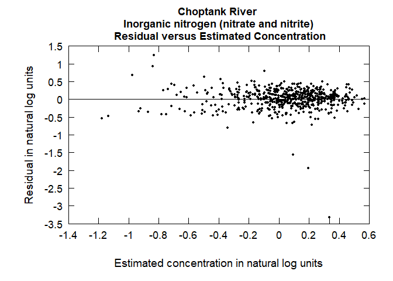

``` r
plotResidQ(eList)
```


``` r
plotResidTime(eList)
```


``` r
boxResidMonth(eList)
```


``` r
boxConcThree(eList)
```


``` r
plotConcHist(eList)
```

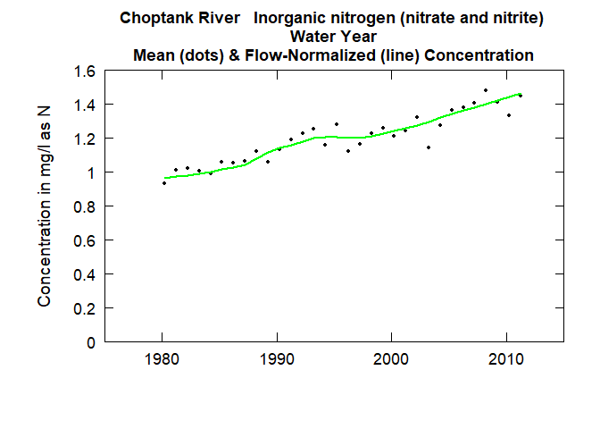

``` r
plotFluxHist(eList)
```

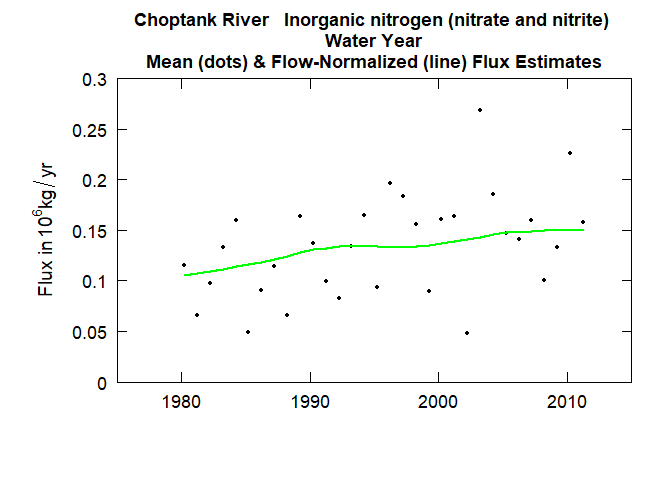

``` r
# Multi-line plots:
date1 <- "1985-09-01"
date2 <- "1997-09-01"
date3 <- "2010-09-01"
qBottom<-0.2
qTop<-10
plotConcQSmooth(eList, date1, date2, date3, qBottom, qTop, 
                   concMax=2,legendTop = 0.85)
```


``` r
q1 <- 2
q2 <- 10
q3 <- 20
centerDate <- "07-01"
yearEnd <- 1980
yearStart <- 2010
plotConcTimeSmooth(eList, q1, q2, q3, centerDate, yearStart, yearEnd, legendTop = 0.55, legendLeft = 1990)
```


``` r
# Multi-plots:
fluxBiasMulti(eList)
```

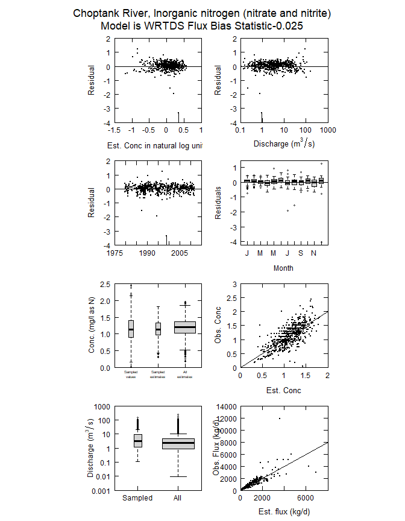

``` r
#Contour plots:
clevel<-seq(0,2,0.5)
yearStart <- 1980
yearEnd <- 2010

plotContours(eList, yearStart,yearEnd,qBottom=0.5,
             qTop=20, contourLevels = clevel)
```

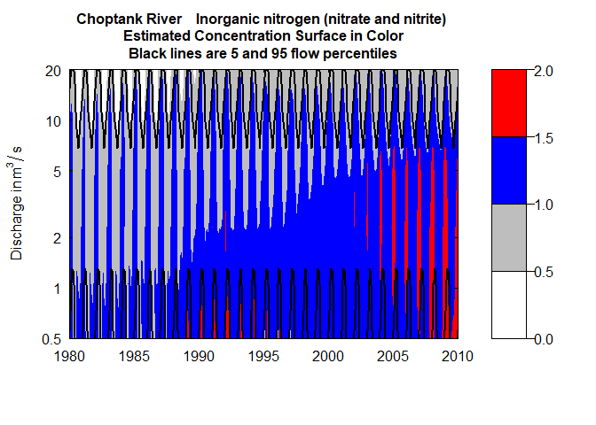

``` r
plotDiffContours(eList, year0 = 1990,
                 year1 = 2010,
                 qBottom=0.5,
                 qTop=20,
                 maxDiff=0.6)
```


### Sample workflow for a flowHistory application for the entire record

``` r
library(EGRET)

# Flow history analysis
# Gather discharge data:
siteID <- "01491000" #Choptank River at Greensboro, MD
startDate <- "" # Get earliest date
endDate <- "" # Get latest date
Daily <- readNWISDaily(siteID,"00060",startDate,endDate)
#> There are 26762 data points, and 26762 days.
# Gather site and parameter information:
# Here user must input some values for
# the default (interactive=TRUE)
INFO<- readNWISInfo(siteID,"00060")
#> Your site for streamflow data is:
#>  01491000 .
#> Your site name is CHOPTANK RIVER NEAR GREENSBORO, MD 
#> but you can modify this to a short name in a style you prefer. 
#> This name will be used to label graphs and tables. 
#> If you want the program to use the name given above, just do a carriage return,
#> otherwise enter the preferred short name(no quotes):
#> 
#> The latitude and longitude of the site are:  38.99719 ,  -75.78581 (degrees north and west).
#> 
#> The drainage area at this site is  113 square miles
#>  which is being stored as 292.6687 square kilometers.
#> 
#> It is helpful to set up a station abbreviation when doing multi-site studies,
#> enter a unique id (three or four characters should work). It is case sensitive.  
#> Even if you don't feel you need an abbreviation for your site you need to enter something(no quotes):
#> 
#> Your water quality data are for parameter number:
#> 00060 
#> which has the name:' Discharge, cubic feet per second '.
#> Typically you will want a shorter name to be used in graphs and tables.
#> The suggested short name is:' Stream flow, mean. daily '.
#> If you would like to change the short name, enter it here, 
#> otherwise just hit enter (no quotes):
#> The units for the water quality data are:  ft3/s .
#> It is helpful to set up a constiuent abbreviation, enter a unique id 
#> three or four characters should work something like tn or tp or NO3).
#> Even if you don't feel you need an abbreviation you need to enter something (no quotes):
#> 
#> Required concentration units are mg/l. 
#> The INFO dataframe indicates: ft3/s 
#> Flux calculations will be wrong if units are not consistent.
INFO$shortName <- "Choptank River at Greensboro, MD"
eList <- as.egret(INFO, Daily, NA, NA)

# Check flow history data:
plotFlowSingle(eList, istat=7,qUnit="thousandCfs")
```


``` r
plotSDLogQ(eList)
```

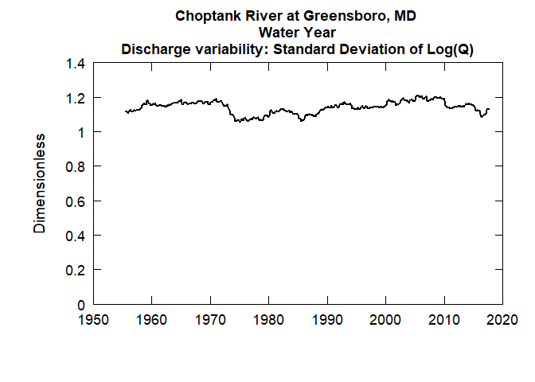

``` r
plotQTimeDaily(eList, qLower=1,qUnit=3)
```

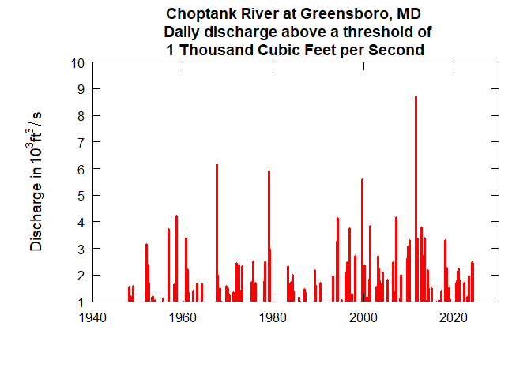

``` r
plotFour(eList, qUnit=3)
```

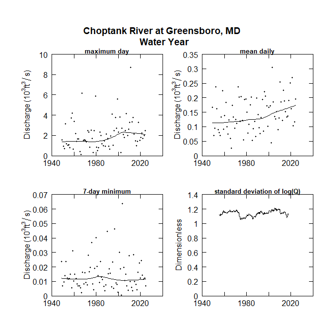

``` r
plotFourStats(eList, qUnit=3)
```


## Model Archive

When using the `WRTDS` model, it is important to be able to reproduce
the results in the future. The following version of R and package
dependencies were used most recently to pass the embedded tests within
this package. There is no guarantee of reproducible results using future
versions of R or updated versions of package dependencies; however, we
will make diligent efforts to test and update future modeling
environments.

``` r
sessioninfo::session_info()
#> - Session info ---------------------------------------------------------------
#>  setting  value                       
#>  version  R version 4.0.4 (2021-02-15)
#>  os       Windows 10 x64              
#>  system   x86_64, mingw32             
#>  ui       RTerm                       
#>  language (EN)                        
#>  collate  English_United States.1252  
#>  ctype    English_United States.1252  
#>  tz       America/Chicago             
#>  date     2021-04-09                  
#> 
#> - Packages -------------------------------------------------------------------
#>  package       * version date       lib source        
#>  assertthat      0.2.1   2019-03-21 [1] CRAN (R 4.0.3)
#>  class           7.3-18  2021-01-24 [2] CRAN (R 4.0.4)
#>  classInt        0.4-3   2020-04-07 [1] CRAN (R 4.0.3)
#>  cli             2.4.0   2021-04-05 [1] CRAN (R 4.0.4)
#>  crayon          1.4.1   2021-02-08 [1] CRAN (R 4.0.3)
#>  curl            4.3     2019-12-02 [1] CRAN (R 4.0.3)
#>  dataRetrieval   2.7.7   2021-04-08 [1] local         
#>  DBI             1.1.1   2021-01-15 [1] CRAN (R 4.0.3)
#>  digest          0.6.27  2020-10-24 [1] CRAN (R 4.0.3)
#>  dotCall64       1.0-1   2021-02-11 [1] CRAN (R 4.0.3)
#>  dplyr           1.0.5   2021-03-05 [1] CRAN (R 4.0.4)
#>  e1071           1.7-6   2021-03-18 [1] CRAN (R 4.0.4)
#>  EGRET         * 3.0.5   2021-04-08 [1] local         
#>  ellipsis        0.3.1   2020-05-15 [1] CRAN (R 4.0.3)
#>  evaluate        0.14    2019-05-28 [1] CRAN (R 4.0.3)
#>  fansi           0.4.2   2021-01-15 [1] CRAN (R 4.0.3)
#>  fields          11.6    2020-10-09 [1] CRAN (R 4.0.3)
#>  generics        0.1.0   2020-10-31 [1] CRAN (R 4.0.3)
#>  glue            1.4.2   2020-08-27 [1] CRAN (R 4.0.3)
#>  highr           0.8     2019-03-20 [1] CRAN (R 4.0.3)
#>  hms             1.0.0   2021-01-13 [1] CRAN (R 4.0.3)
#>  htmltools       0.5.1.1 2021-01-22 [1] CRAN (R 4.0.3)
#>  httr            1.4.2   2020-07-20 [1] CRAN (R 4.0.3)
#>  jsonlite        1.7.2   2020-12-09 [1] CRAN (R 4.0.3)
#>  KernSmooth      2.23-18 2020-10-29 [2] CRAN (R 4.0.4)
#>  knitr           1.31    2021-01-27 [1] CRAN (R 4.0.3)
#>  lattice         0.20-41 2020-04-02 [2] CRAN (R 4.0.4)
#>  lifecycle       1.0.0   2021-02-15 [1] CRAN (R 4.0.4)
#>  magrittr        2.0.1   2020-11-17 [1] CRAN (R 4.0.3)
#>  maps            3.3.0   2018-04-03 [1] CRAN (R 4.0.3)
#>  Matrix          1.3-2   2021-01-06 [2] CRAN (R 4.0.4)
#>  pillar          1.5.1   2021-03-05 [1] CRAN (R 4.0.4)
#>  pkgconfig       2.0.3   2019-09-22 [1] CRAN (R 4.0.3)
#>  proxy           0.4-25  2021-03-05 [1] CRAN (R 4.0.4)
#>  purrr           0.3.4   2020-04-17 [1] CRAN (R 4.0.3)
#>  R6              2.5.0   2020-10-28 [1] CRAN (R 4.0.3)
#>  Rcpp            1.0.6   2021-01-15 [1] CRAN (R 4.0.3)
#>  readr           1.4.0   2020-10-05 [1] CRAN (R 4.0.3)
#>  rlang           0.4.10  2020-12-30 [1] CRAN (R 4.0.3)
#>  rmarkdown       2.7     2021-02-19 [1] CRAN (R 4.0.3)
#>  sessioninfo     1.1.1   2018-11-05 [1] CRAN (R 4.0.3)
#>  sf              0.9-8   2021-03-17 [1] CRAN (R 4.0.4)
#>  spam            2.6-0   2020-12-14 [1] CRAN (R 4.0.3)
#>  stringi         1.5.3   2020-09-09 [1] CRAN (R 4.0.3)
#>  stringr         1.4.0   2019-02-10 [1] CRAN (R 4.0.3)
#>  survival        3.2-7   2020-09-28 [2] CRAN (R 4.0.4)
#>  tibble          3.1.0   2021-02-25 [1] CRAN (R 4.0.4)
#>  tidyselect      1.1.0   2020-05-11 [1] CRAN (R 4.0.3)
#>  units           0.7-1   2021-03-16 [1] CRAN (R 4.0.4)
#>  utf8            1.2.1   2021-03-12 [1] CRAN (R 4.0.4)
#>  vctrs           0.3.7   2021-03-29 [1] CRAN (R 4.0.4)
#>  withr           2.4.1   2021-01-26 [1] CRAN (R 4.0.3)
#>  xfun            0.22    2021-03-11 [1] CRAN (R 4.0.4)
#>  xml2            1.3.2   2020-04-23 [1] CRAN (R 4.0.3)
#>  yaml            2.2.1   2020-02-01 [1] CRAN (R 4.0.3)
#> 
#> [1] C:/Users/ldecicco/Documents/R/win-library/4.0
#> [2] C:/Program Files/R/R-4.0.4/library
```

## Reporting bugs

Please consider reporting bugs and asking questions on the Issues page:
<https://github.com/USGS-R/EGRET/issues>

Follow `@USGS_DataSci` on Twitter for updates on USGS R packages:

[](https://twitter.com/USGS_DataSci)

## Subscribe

Please email questions, comments, and feedback to:
<egret_comments@usgs.gov>

Additionally, to subscribe to an email list concerning updates to these
R packages, please send a request to <egret_comments@usgs.gov>.

## Code of Conduct

We want to encourage a warm, welcoming, and safe environment for
contributing to this project. See the [code of
conduct](https://github.com/USGS-R/EGRET/blob/master/CONDUCT.md) for
more information.

## Package Support

The Water Mission Area of the USGS has supported the development and
maintenance of the `EGRET` R-package. Further maintenance is expected to
be stable through October 2022. Resources are available primarily for
maintenance and responding to user questions. Priorities on the
development of new features are determined by the `EGRET` development
team.

[](https://www.usgs.gov/)

## Sunset date

Funding for `EGRET` currently expires fall 2022. Expectations are that
maintenance and customer service will continue to be supported past that
date.

## How to cite EGRET:

``` r
citation(package = "EGRET")
#> 
#> To cite EGRET in publications, please use:
#> 
#>   Hirsch, R.M., and De Cicco, L.A., 2015, User guide to Exploration and
#>   Graphics for RivEr Trends (EGRET) and dataRetrieval: R packages for
#>   hydrologic data (version 2.0, February 2015): U.S. Geological Survey
#>   Techniques and Methods book 4, chap. A10, 93 p., doi:10.3133/tm4A10
#> 
#> A BibTeX entry for LaTeX users is
#> 
#>   @InBook{,
#>     author = {Robert M. Hirsch and Laura A. {De Cicco}},
#>     title = {User guide to Exploration and Graphics for RivEr Trends (EGRET) and dataRetrieval: R packages for hydrologic data},
#>     publisher = {U.S. Geological Survey},
#>     address = {Reston, VA},
#>     booktitle = {Techniques and Methods},
#>     institution = {U.S. Geological Survey},
#>     year = {2015},
#>     chapter = {A10},
#>     url = {https://pubs.usgs.gov/tm/04/a10/},
#>   }
```

## References

See this list for WRTDS applications in print:

<http://usgs-r.github.io/EGRET/articles/References_WRTDS.html>

## Disclaimer

This software has been approved for release by the U.S. Geological
Survey (USGS). Although the software has been subjected to rigorous
review, the USGS reserves the right to update the software as needed
pursuant to further analysis and review. No warranty, expressed or
implied, is made by the USGS or the U.S. Government as to the
functionality of the software and related material nor shall the fact of
release constitute any such warranty. Furthermore, the software is
released on condition that neither the USGS nor the U.S. Government
shall be held liable for any damages resulting from its authorized or
unauthorized use.
