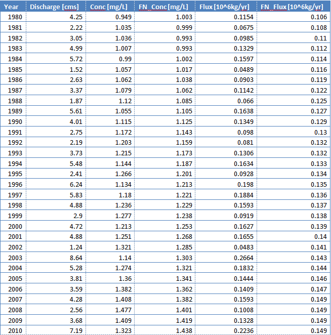

```{r include=TRUE ,echo=FALSE,eval=TRUE, message=FALSE, warning=FALSE}

library(EGRET)
library(knitr)

knitr::opts_chunk$set(echo = TRUE, 
                      warning = FALSE, 
                      message = FALSE,
                      fig.height=7,
                      fig.width=7,
                      out.width = "45%",
                      fig.show = 'hold',
                      fig.align = 'center')

```


# Introduction 

EGRET includes statistics and graphics for streamflow history, water quality trends, and the statistical modeling algorithm Weighted Regressions on Time, Discharge, and Season (WRTDS).  Please see the official EGRET User Guide @hirsch_user_2015 for more information on the EGRET package:

[https://doi.org/10.3133/tm4A10](https://doi.org/10.3133/tm4A10)

For information on getting started in R, downloading and installing the package, see the [New to R](#new-to-r) section.

The best ways to learn about the WRTDS approach is to read the User Guide and two journal articles. These articles are available, for free, from the journals in which they were published. 

The first relates to nitrate and total phosphorus data for 9 rivers draining to Chesapeake Bay. The URL is @hirsch_weighted_2010: [https://onlinelibrary.wiley.com/doi/full/10.1111/j.1752-1688.2010.00482.x](https://onlinelibrary.wiley.com/doi/full/10.1111/j.1752-1688.2010.00482.x). 

The second is an application to nitrate data for 8 monitoring sites on the Mississippi River or its major tributaries @sprague_nitrate_2011.  The URL is: [https://pubs.acs.org/doi/abs/10.1021/es201221s](https://pubs.acs.org/doi/abs/10.1021/es201221s)

This vignette assumes that you understand the concepts underlying WRTDS, and reading the relevant sections of the User Guide at least the first of these papers. Any use of trade, firm, or product names is for descriptive purposes only and does not imply endorsement by the U.S. Government.


# EGRET Workflow

Subsequent sections of this vignette discuss the EGRET workflow steps in greater detail. This section provides a handy cheat sheet for diving into an EGRET analysis. The first example is for a flow history analysis:


```{r workflowFlowHistory, echo=TRUE,eval=FALSE}
library(EGRET)

# Flow history analysis

############################
# Gather discharge data:
siteNumber <- "01491000" #Choptank River at Greensboro, MD
startDate <- "" # Get earliest date
endDate <- "" # Get latest date
Daily <- readNWISDaily(siteNumber,"00060",startDate,endDate)
# Gather site and parameter information:
# Here user must input some values for
# the default (interactive=TRUE)
INFO <- readNWISInfo(siteNumber,"00060")
INFO$shortName <- "Choptank River near Greensboro, MD"
############################

############################
# Check flow history data:
eList <- as.egret(INFO, Daily, NA, NA)
plotFlowSingle(eList, istat=7,qUnit="thousandCfs")
plotSDLogQ(eList)
plotQTimeDaily(eList, qLower=1,qUnit=3)
plotFour(eList, qUnit=3)
plotFourStats(eList, qUnit=3)
############################

# modify this for your own computer file structure:
savePath<-"/Users/rhirsch/Desktop/" 
saveResults(savePath, eList)

```

The second workflow example is for a water quality analysis. It includes data retrieval, merging of water quality and streamflow data, running the WRTDS estimation, and various plotting functions available in the EGRET package.


```{r workflowWaterQuality, echo=TRUE,eval=FALSE}
library(EGRET)

############################
# Gather discharge data:
siteNumber <- "01491000" #Choptank River near Greensboro, MD
startDate <- "" #Gets earliest date
endDate <- "2011-09-30"
# Gather sample data:
parameter_cd<-"00631" #5 digit USGS code
Sample <- readNWISSample(siteNumber,parameter_cd,startDate,endDate)
#Gets earliest date from Sample record:
#This is just one of many ways to assure the Daily record
#spans the Sample record
startDate <- min(as.character(Sample$Date)) 
# Gather discharge data:
Daily <- readNWISDaily(siteNumber,"00060",startDate,endDate)
# Gather site and parameter information:

# Here user must input some values:
INFO<- readNWISInfo(siteNumber,parameter_cd)
INFO$shortName <- "Choptank River at Greensboro, MD"

# Merge discharge with sample data:
eList <- mergeReport(INFO, Daily, Sample)
############################

############################
# Check sample data:
boxConcMonth(eList)
boxQTwice(eList)
plotConcTime(eList)
plotConcQ(eList)
multiPlotDataOverview(eList)
############################

############################
# Run WRTDS model:
eList <- modelEstimation(eList)
############################

############################
#Check model results:

#Require Sample + INFO:
plotConcTimeDaily(eList)
plotFluxTimeDaily(eList)
plotConcPred(eList)
plotFluxPred(eList)
plotResidPred(eList)
plotResidQ(eList)
plotResidTime(eList)
boxResidMonth(eList)
boxConcThree(eList)

#Require Daily + INFO:
plotConcHist(eList)
plotFluxHist(eList)

# Multi-line plots:
date1 <- "1985-09-01"
date2 <- "1997-09-0"
date3 <- "2010-09-01"
qBottom<-0.2
qTop<-10
plotConcQSmooth(eList, date1, date2, date3, qBottom, qTop, 
                   concMax=2,legendTop = 0.8)
q1 <- 2
q2 <- 10
q3 <- 20
centerDate <- "07-01"
yearEnd <- 1980
yearStart <- 2010
plotConcTimeSmooth(eList, q1, q2, q3, centerDate, yearStart, yearEnd, legendTop = 0.7)

# Multi-plots:
fluxBiasMulti(eList)

#Contour plots:
clevel<-seq(0,2,0.5)
maxDiff<-0.8
yearStart <- 1980
yearEnd <- 2010

plotContours(eList, yearStart,yearEnd,qBottom,qTop, 
             contourLevels = clevel,qUnit=2)
plotDiffContours(eList, yearStart,yearEnd,
                 qBottom,qTop,maxDiff,qUnit=2)

# modify this for your own computer file structure:
savePath<-"/Users/rhirsch/Desktop/" 
saveResults(savePath, eList)
```


# EGRET Data Frames and Retrieval Options {#data_frame}

The EGRET package uses 3 default data frames throughout the calculations, analysis, and graphing. These data frames are [Daily](#data_frame_Daily), [Sample](#data_frame_Sample), and [INFO](#data_frame_INFO). The data frames are combined into a named list for all EGRET functions using the `as.egret` function (see [Merge Report](#eList)). 

A package that EGRET depends on is called dataRetrieval. This package provides the core functionality to import hydrologic data from USGS and EPA web services. See the dataRetrieval vignette for more information.

```{r openDataRetrieval, eval=FALSE}
library(dataRetrieval)
vignette("dataRetrieval")
```

EGRET uses entirely SI units to store the data, but for purposes of output, it can report results in a wide variety of units, which will be discussed in the [Units](#units) section. To start our exploration, you must install the packages, then open EGRET with the following command:

```{r openlibraries, echo=TRUE,eval=FALSE}
library(EGRET)
```

## Daily {#data_frame_Daily}

The Daily data frame can be imported into R either from USGS web services (`readNWISDaily`) or user-generated files (`readUserDaily`).  After you run the WRTDS calculations by using the function `modelEstimation` (as will be described in the [WRTDS section](#wrtds), additional columns are inserted.

|ColumnName|Type|Description|Units| 
|:----------|:---------|----------------:|-----:|
|Date|Date|Date|date| 
|Q|number|Discharge in m^3^/s|m^3^/s| 
|Julian|number|Number of days since January 1, 1850|days| 
|Month|integer|Month of the year [1-12]|months| 
|Day|integer|Day of the year [1-366]|days| 
|DecYear|number|Decimal year|years| 
|MonthSeq|integer|Number of months since January 1, 1850|months| 
|Qualifier|character|Qualifying code|string| 
|i|integer|Index of days, starting with 1|days| 
|LogQ|number|Natural logarithm of Q|numeric| 
|Q7|number|7 day running average of Q|m^3^/s| 
|Q30|number|30 day running average of Q|m^3^/s| 

  
|ColumnName|Type|Description|Units| 
|:----------|:---------|----------------:|-----:|
|yHat|number|The WRTDS estimate of the log of concentration|numeric| 
|SE|number|The WRTDS estimate of the standard error of yHat|numeric| 
|ConcDay|number|The WRTDS estimate of concentration|mg/L| 
|FluxDay|number|The WRTDS estimate of flux|kg/day| 
|FNConc|number|Flow-normalized estimate of concentration|mg/L| 
|FNFlux|number|Flow-normalized estimate of flux|kg/day| 
Table: Columns added to Daily data frame after running `modelEstimation`

Notice that the "Day of the year" column can span from 1 to 366. The 366 accounts for leap years. Every day has a consistent day of the year. This means, February 28^th^ is always the 59^th^ day of the year, Feb. 29^th^ is always the 60^th^ day of the year, and March 1^st^ is always the 61^st^ day of the year whether or not it is a leap year.

### readNWISDaily {#nwisDailyFile}

The `readNWISDaily` function retrieves the daily values (discharge in this case) from a USGS web service.  It requires the inputs siteNumber, parameterCd, startDate, endDate, interactive, and convert. 

These arguments are described in detail in the `dataRetrieval` vignette, however `convert` is a new argument (which defaults to TRUE). The convert argument tells the program to convert the values from cubic feet per second (ft^3^/s) to cubic meters per second (m^3^/s) as shown in the example Daily data frame. For EGRET applications with NWIS Web retrieval, do not use this argument (the default is TRUE), EGRET assumes that discharge is always stored in units of cubic meters per second. If you don't want this conversion and are not using EGRET, set convert=FALSE in the function call. 

```{r firstExample, echo=TRUE, eval=FALSE}
siteNumber <- "01491000"
startDate <- "2000-01-01"
endDate <- "2013-01-01"
# This call will get NWIS (ft3/s) data , and convert it to m3/s:
Daily <- readNWISDaily(siteNumber, "00060", startDate, endDate)
```

If discharge values are negative or zero, the code will set all of these values to zero and then add a small constant to all of the daily discharge values.  This constant is 0.001 times the mean discharge.  The code will also report on the number of zero and negative values and the size of the constant.  Use EGRET analysis only if the number of zero values is a very small fraction of the total days in the record (say less than 0.1% of the days), and there are no negative discharge values.  Columns Q7 and Q30 are the 7 and 30 day running averages for the 7 or 30 days ending on this specific date. 

### readUserDaily {#DailyFile}
 
The `readUserDaily` function will load a user-supplied text file and convert it to the Daily data frame. The file should have two columns, the first dates, the second values.  The dates are formatted either mm/dd/yyyy or yyyy-mm-dd. Using a 4-digit year is required. This function has the following inputs: filePath, fileName, hasHeader (TRUE/FALSE), separator, qUnit, and interactive (TRUE/FALSE). filePath is a character that defines the path to your file, and the character can either be a full path, or path relative to your R working directory. The input fileName is a character that defines the file name (including the extension).

Text files that contain this sort of data require some sort of a separator, for example, a "csv" file (comma-separated value) file uses a comma to separate the date and value column. A tab delimited file would use a tab (`"\t"`) rather than the comma (`","`). Define the type of separator you choose to use in the function call in the `separator` argument, the default is `","`. Another function input is a logical variable: hasHeader.  The default is TRUE. If your data does not have column names, set this variable to FALSE.

Finally, qUnit is a numeric argument that defines the discharge units used in the input file.  The default is qUnit = 1 which assumes discharge is in cubic feet per second.  If the discharge in the file is already in cubic meters per second then set qUnit = 2.  If it is in some other units (like liters per second or acre-feet per day), the user must pre-process the data with a unit conversion that changes it to either cubic feet per second or cubic meters per second.

So, if you have a file called "ChoptankRiverFlow.txt" located in a folder called "RData" on the C drive (this example is for the Windows&trade; operating systems), and the file is structured as follows (tab-separated):


```
date  Qdaily
10/1/1999  107
10/2/1999  85
10/3/1999  76
10/4/1999  76
10/5/1999	113
10/6/1999	98
...
```

The call to open this file, convert the discharge to cubic meters per second, and populate the Daily data frame would be:
```{r openDaily, eval = FALSE}
fileName <- "ChoptankRiverFlow.txt"
filePath <-  "C:/RData/"
Daily <- readUserDaily(filePath,fileName,
                    separator="\t")
```

Microsoft&trade; Excel files can be a bit tricky to import into R directly. The simplest way to get Excel data into R is to open the Excel file in Excel, then save it as a .csv file (comma-separated values). 

## Sample {#data_frame_Sample}
 
The Sample data frame initially is populated with columns generated by either the `readNWISSample`, `readWQPSample`, or `readUserSample` functions. After you run the WRTDS calculations using the `modelEstimation` function (as described in the [WRTDS](#wrtds) section, additional columns are inserted:

|ColumnName|Type|Description|Units| 
|:----------|:---------|----------------:|-----:|
|Date|Date|Date|date| 
|ConcLow|number|Lower limit of concentration|mg/L| 
|ConcHigh|number|Upper limit of concentration|mg/L| 
|Uncen|integer|Uncensored data (1=true, 0=false)|integer| 
|ConcAve|number|Average concentration|mg/L| 
|Julian|number|Number of days since January 1, 1850|days| 
|Month|integer|Month of the year [1-12]|months| 
|Day|integer|Day of the year [1-366]|days| 
|DecYear|number|Decimal year|years| 
|MonthSeq|integer|Number of months since January 1, 1850|months| 
|SinDY|number|Sine of DecYear|numeric| 
|CosDY|number|Cosine of DecYear|numeric| 
|Q|number|Discharge|cms| 
|LogQ|number|Natural logarithm of discharge|numeric| 

|ColumnName|Type|Description|Units| 
|:----------|:---------|----------------:|-----:|
|yHat|number|estimate of the log of concentration|numeric| 
|SE|number|estimate of the standard error of yHat|numeric|
|ConcHat|number|unbiased estimate of concentration|mg/L| 
Table: Columns added to Sample data frame after running `modelEstimation`

As with the Daily data frame, the "Day of the year" column can span from 1 to 366. The 366 accounts for leap years. Every day has a consistent day of the year. This means, February 28^th^ is always the 59^th^ day of the year, Feb. 29^th^ is always the 60^th^ day of the year, and March 1^st^ is always the 61^st^ day of the year whether or not it is a leap year.

The [censored value](#cenValues) section is about summing multiple constituents, including how interval censoring is used. Since the Sample data frame is structured to only contain one constituent, when more than one parameter codes are requested, the `readNWISSample` function will sum the values of each constituent as described below.

### readNWISSample {#readNWISSample}
 
The `readNWISSample` function retrieves USGS sample data from NWIS. The arguments for this function are also siteNumber, parameterCd, startDate, endDate, interactive. These are the same inputs as `readNWISDaily` as described in the previous section.

```{r secondExample,echo=TRUE,eval=FALSE}
siteNumber <- "01491000"
parameterCd <- "00618"
Sample <-readNWISSample(siteNumber,parameterCd,
      startDate, endDate)
```

Information on USGS parameter codes can be found here:

[https://help.waterdata.usgs.gov/codes-and-parameters/parameters](https://help.waterdata.usgs.gov/codes-and-parameters/parameters)

### readWQPSample {#readWQPSample}

The `readWQPSample` function retrieves Water Quality Portal sample data (STORET, NWIS, STEWARDS). The arguments for this function are siteNumber, characteristicName, startDate, endDate, interactive. 

```{r STORET,echo=TRUE,eval=FALSE}
site <- 'WIDNR_WQX-10032762'
characteristicName <- 'Specific conductance'
Sample <-readWQPSample(site,characteristicName,
      startDate, endDate)
```

To request USGS data from the Water Quality Portal, the siteNumber must have "USGS-" pasted before the identification number. For USGS data, the `characteristicName` argument can be either a list of 5-digit parameter codes, or the characteristic name. A table that describes how USGS parameters relate with the defined characteristic name can be found here:

[https://www.waterqualitydata.us/public_srsnames](https://www.waterqualitydata.us/public_srsnames)

### readUserSample {#SampleFile}

The `readUserSample` function will import a user-generated file and populate the Sample data frame. The difference between sample data and discharge data is that the code requires a third column that contains a remark code, either blank or `"<"`, which will tell the program that the data were "left-censored" (or, below the detection limit of the sensor). Therefore, the data must be in the form: date, remark, value.  An example of a comma-delimited file is:

```
cdate;remarkCode;Nitrate
10/7/1999,,1.4
11/4/1999,<,0.99
12/3/1999,,1.42
1/4/2000,,1.59
2/3/2000,,1.54
...
```

The call to open this file, and populate the Sample data frame is:
```{r openSample, eval = FALSE}
fileName <- "ChoptankRiverNitrate.csv"
filePath <-  "C:/RData/"
Sample <- readUserSample(filePath,fileName,
                                separator=",")
```

When multiple constituents are to be summed, the format can be date, remark_A, value_A, remark_b, value_b, etc... A tab-separated example might look like the file below, where the columns are date, remark dissolved phosphate (rdp), dissolved phosphate (dp), remark particulate phosphorus (rpp), particulate phosphorus (pp), remark total phosphate (rtp), and total phosphate (tp):

```
date  rdp  dp	rpp	pp	rtp	tp
2003-02-15		0.020		0.500		
2003-06-30	<	0.010		0.300		
2004-09-15	<	0.005	<	0.200		
2005-01-30						0.430
2005-05-30					<	0.050
2005-10-30					<	0.020
...
```


```{r openSample2, eval = FALSE}
fileName <- "ChoptankPhosphorus.txt"
filePath <-  "C:/RData/"
Sample <-readUserSample(filePath,fileName,
                                separator="\t")
```

### Censored Values: Summation Explanation {#cenValues}

In the typical case where none of the data are censored (that is, no values are reported as "less-than" values), the ConcLow = ConcHigh = ConcAve which are all equal to the reported value, and Uncen = 1 for all values.  For the most common type of censoring, where a value is reported as less than the reporting limit, then ConcLow = NA, ConcHigh = reporting limit, ConcAve = 0.5 * reporting limit, and Uncen = 0.

To illustrate how the EGRET package handles a more complex censoring problem, let us say that in 2004 and earlier, we computed total phosphorus (tp) as the sum of dissolved phosphorus (dp) and particulate phosphorus (pp). From 2005 and onward, we have direct measurements of total phosphorus (tp). A small subset of this fictional data is provided:

```{r label=tab:exampleComplexQW, echo=FALSE, eval=TRUE,results='asis'}
cdate <- c("2003-02-15","2003-06-30","2004-09-15","2005-01-30","2005-05-30","2005-10-30")
rdp <- c("", "<","<","","","")
dp <- c(0.02,0.01,0.005,NA,NA,NA)
rpp <- c("", "","<","","","")
pp <- c(0.5,0.3,0.2,NA,NA,NA)
rtp <- c("","","","","<","<")
tp <- c(NA,NA,NA,0.43,0.05,0.02)

DF <- data.frame(cdate,rdp,dp,rpp,pp,rtp,tp,stringsAsFactors=FALSE)

knitr::kable(DF,  caption="Example data", 
                     digits=c(0,0,0,3,0,3,0,3))

```

EGRET will "add up" all the values in a given row to form the total for that sample when using the Sample data frame. Thus, you only want to enter data that should be added together. If you want a data frame with multiple constituents that are not summed, do not use `readNWISSample`, `readWQPSample`, or `readUserSample`. The raw data functions: `getWQPdata`, `readNWISqw`, `readWQPqw`, `readWQPdata` from the EGRET package will not sum constituents, but leave them in their individual columns. 

For example, we might know the value for dp on 5/30/2005, but we don't want to put it in the table because under the rules of this data set, we are not supposed to add it in to the values in 2005.

For every sample, the EGRET package requires a pair of numbers to define an interval in which the true value lies (ConcLow and ConcHigh). In a simple uncensored case (the reported value is above the detection limit), ConcLow equals ConcHigh and the interval collapses down to a single point. In a simple censored case, the value might be reported as <0.2, then ConcLow=NA and ConcHigh=0.2. We use NA instead of 0 as a way to elegantly handle future logarithm calculations.

For the more complex example case, let us say dp is reported as <0.01 and pp is reported as 0.3. We know that the total must be at least 0.3 and could be as much as 0.31. Therefore, ConcLow=0.3 and ConcHigh=0.31. Another case would be if dp is reported as <0.005 and pp is reported <0.2. We know in this case that the true value could be as low as zero, but could be as high as 0.205. Therefore, in this case, ConcLow=NA and ConcHigh=0.205. The Sample data frame for the example data would be:

```{r thirdExample,echo=FALSE}
  compressedData <- compressData(DF)
  Sample <- populateSampleColumns(compressedData)
```

```{r thirdExampleView,echo=TRUE}
  Sample
```

## INFO {#data_frame_INFO}
 
The INFO data frame stores information about the measurements, such as station name, parameter name, drainage area, and so forth. There can be many additional, optional columns, but the columns in the table below are required to initiate the EGRET analysis. After you run the WRTDS calculations (as described in the [WRTDS](#wrtds) section, additional columns are automatically inserted into the INFO data frame (see the EGRET User Guide for complete description of each term):

|ColumnName|Type|Description| 
|:----------|---------:|---------------------------------:|
|shortName|character|Name of site, suitable for use in graphical headings| 
|staAbbrev|character|Abbreviation for station name, used in saveResults| 
|paramShortName|character|Name of constituent, suitable for use in graphical headings| 
|constitAbbrev|character|Abbreviation for constituent name, used in saveResults| 
|drainSqKm|numeric|Drainage area in  km^2^| 
|paStart|integer (1-12)|Starting month of period of analysis| 
|paLong|integer (1-12)|Length of period of analysis in months| 

|ColumnName|Description|Units| 
|:----------|-----------------------------------:|-----:|  
|bottomLogQ|Lowest discharge in prediction surfaces|dimensionless| 
|stepLogQ|Step size in log discharge in prediction surfaces|dimensionless| 
|nVectorLogQ|Number of steps in discharge, prediction surfaces|integer| 
|bottomYear|Starting year in prediction surfaces|years| 
|stepYear|Step size in years in prediction surfaces|years| 
|nVectorYear|Number of steps in years in prediction surfaces|integer| 
|windowY|Half-window width in the time dimension|year| 
|windowQ|Half-window width in the log discharge dimension|dimensionless| 
|windowS|Half-window width in the seasonal dimension|years|
|minNumObs|Minimum number of observations for regression|integer| 
|minNumUncen|Minimum number of uncensored observations|integer| 
Table: INFO data frame after running `modelEstimation`

### readNWISInfo {#nwisINFO}

The function `readNWISInfo` combines `readNWISsite` and `readNWISpCode` from the `dataRetrieval` package, producing one data frame called INFO.

```{r ThirdExample, eval=FALSE}
parameterCd <- "00618"
siteNumber <- "01491000"
INFO <- readNWISInfo(siteNumber,parameterCd, interactive=FALSE)
```

### readWQPInfo {#wqpINFO}
 
It is also possible to create the INFO data frame using information from the Water Quality Portal. As with `readWQPSample`, if the requested site is a USGS siteNumber, "USGS-" needs to be appended to the siteNumber.

```{r WQPInfo, eval=FALSE}
parameterCd <- "00618"
INFO_WQP <- readWQPInfo("USGS-01491000",parameterCd)
```

### readUserInfo {#userINFO}

The function `readUserInfo` can be used to convert comma separated files into an INFO data frame. At a minimum, EGRET analysis uses columns: param.units, shortName, paramShortName, constitAbbrev, and drainSqKm. For example, if the following comma-separated file (csv) was available as a file called "INFO.csv", located in a folder called "RData" on the C drive (this examples is for Windows&trade; operation system), the function to convert it to an INFO data frame is as follows.

```
param.units, shortName, paramShortName, constitAbbrev, drainSqKm
mg/l, Choptank River, Inorganic nitrogen, N, 292.67
```
```{r addInfoCustom, eval=FALSE, echo=TRUE}

fileName <- "INFO.csv"
filePath <- "C:/RData/"

INFO <- readUserInfo(filePath, fileName)

```

### Inserting Additional Info {#addINFO}

Any supplemental column that would be useful can be added to the INFO data frame. 

```{r addInfo, eval=FALSE, echo=TRUE}

INFO$riverInfo <- "Major tributary of the Chesapeake Bay"
INFO$GreensboroPopulation <- 1931

```

## Merge Report: eList {#eList}

Finally, there is a function called `mergeReport` that will look at both the Daily and Sample data frame, and populate Q and LogQ columns into the Sample data frame. Once `mergeReport` has been run, the Sample data frame will be augmented with the daily discharges for all the days with samples, and a named list with all of the data frames will be created.  In this vignette, we will refer to this named list as `eList`: it is a list with potentially 3 data frames: Daily, Sample, and INFO. For flow history analysis, the Sample data frame can be NA.You can use the function `as.egret` to create this "EGRET" object.

None of the water quality functions in EGRET will work without first having run the `mergeReport` function.

```{r mergeExample, eval=FALSE}
siteNumber <- "01491000"
parameterCd <- "00631"  # Nitrate
startDate <- "2000-01-01"
endDate <- "2013-01-01"

Daily <- readNWISDaily(siteNumber, "00060", startDate, endDate)
Sample <- readNWISSample(siteNumber,parameterCd, startDate, endDate)
INFO <- readNWISInfo(siteNumber, parameterCd)

eList <- mergeReport(INFO, Daily,Sample)
```

Perhaps you already have Daily, Sample, and INFO data frames, and surfaces matrix (created after running the WRTDS `modelEstimation`) that have gone though a deprecated version of EGRET. You can create and edit an EGRET object as follows:

```{r egretObedit, echo=TRUE, eval=FALSE}
eListNew <- as.egret(INFO, Daily, Sample, surfaces)
#To pull out the INFO data frame:
INFO <- getInfo(eListNew)
#Edit the INFO data frame:
INFO$importantNews <- "New EGRET workflow started"
#Put new data frame in eListNew
eListNew$INFO <- INFO
#To pull out Daily:
Daily <- getDaily(eListNew)
#Edit for some reason:
DailyNew <- Daily[Daily$DecYear > 1985,]
#Put new Daily data frame back in eListNew:
eListNew$Daily <- DailyNew
#To create a whole new egret object:
eList_2 <- as.egret(INFO, DailyNew, getSample(eListNew), NA)

```

# Units {#units}

EGRET uses entirely SI units to store the data, but for purposes of output, it can report results in a wide variety of units. The defaults are mg/L for concentration, cubic meters per second (m^3^/s) for discharge, kg/day for flux, and km^2^ for drainage area. When discharge values are imported from USGS Web services, they are automatically converted from cubic feet per second (cfs) to cms unless the argument `convert` in function `readNWISDaily` is set to FALSE.  This can cause confusion if you are not careful. 
For all functions that provide output, you can define two arguments to set the output units: qUnit and fluxUnit.  qUnit and fluxUnit are defined by either a numeric code or name.  You can call two functions that can be called to see the options: `printqUnitCheatSheet` and `printFluxUnitCheatSheet`.

```{r cheatSheets,echo=TRUE,eval=TRUE,results='markup'}
printqUnitCheatSheet()
```

When a function has an input argument qUnit, you can define the discharge units that will be used in the figure or table that is generated by the function with the index (1-4) as shown above. Base your choice on the units that are customary for your intended audience, but also so that the discharge values don't have too many digits to the right or left of the decimal point.

```{r cheatSheets2,echo=TRUE,eval=TRUE,results='markup'}
printFluxUnitCheatSheet()
```

When a function has an input argument fluxUnit, you can define the flux units with the index (1-12) as shown above. Base the choice on the units that are customary for your intended audience, but also so that the flux values don't have too many digits to the right or left of the decimal point. Tons are always "short tons" and not "metric tons".

Note that when the analysis being done is for a single month or season (see discussion of "Period of Analysis" in [Flow History](#flowHistory) that the flux values represent a rate (mass per unit time).  Thus, if the period of analysis is the combination of April and May, then a reported flux of 1000 kg/year translates to a mass of 1000 * 61 / 365.25 = 167 kg.  Thus, in general, if the flux is reported as a mass per year, then to get a mass for the season that value should be multiplied by the number of days in the season and then divided by 365.25.

# Flow History {#flowHistory}
 
This section describes functions included in the EGRET package that provide a variety of table and graphical outputs for examining discharge statistics based on time-series smoothing. These functions are designed for studies of long-term change and work best for daily discharge data sets of 50 years or longer. This type of analysis might be useful for studying issues such as the influence of land use change, water management change, or climate change on discharge conditions.  This includes potential impacts on average discharges, high discharges, and low discharges, at annual time scales as well as seasonal or monthly time scales. 

Consider this example from Columbia River at The Dalles, OR.

```{r flowHistory,echo=TRUE,eval=FALSE}
siteNumber <- "14105700"  
startDate <- ""
endDate <- ""

Daily <- readNWISDaily(siteNumber,"00060",startDate,endDate)
INFO <- readNWISInfo(siteNumber,"",interactive=FALSE)
INFO$shortName <- "Columbia River at The Dalles, OR"

eList <- as.egret(INFO, Daily, NA, NA)
```

```{r flowHistoryLoad,echo=FALSE}
fileName <- "eListColumbia.RData"
load(fileName)
eList <- eListColumbia
```

You first must determine the period of analysis to use (PA). What is the period of analysis?  If you want to examine your data set as a time series of water years, then the period of analysis is October through September.  If you want to examine the data set as calendar years then the period of analysis is January through December.  You might want to examine the winter season, which you could define as December through February, then those 3 months become the period of analysis. The only constraints on the definition of a period of analysis are these: it must be defined in terms of whole months; it must be a set of contiguous months (like March-April-May), and have a length that is no less than 1 month and no more than 12 months.  Define the PA by using two arguments: paLong and paStart.  paLong is the length of the PA, and paStart is the first month of the PA. 

|Period of Analysis|paStart|paLong| 
|:----------|---:|---:|
|Calendar Year|1|12| 
|Water Year|10|12| 
|Winter|12|3| 
|September|9|1| 
Table: Period of Analysis Information

To set a period running from December through February:
```{r newChunckWinter, echo=TRUE,eval=FALSE}
eList <- setPA(eList,paStart=12,paLong=3)
```

To set the default value (water year):
```{r newChunck, echo=TRUE}
eList <- setPA(eList)
```

The next step can be to create the annual series of discharge statistics.  These are returned in a matrix that contain the statistics described below. The statistics are based on the period of analysis set with the `setPA` function.

|istat|Name| 
|---:|--------------------:|
|1|minimum 1-day daily mean discharg| 
|2|minimum 7-day mean of the daily mean discharges| 
|3|minimum 30-day mean of the daily mean discharges| 
|4|median of the daily mean discharges| 
|5|mean of the daily mean discharges| 
|6|maximum 30-day mean of the daily mean discharges| 
|7|maximum 7-day mean of the daily mean discharges| 
|8|maximum 1-day daily mean discharge| 
Table: Index of discharge statistics information

## Plotting Options {#plotOptions}

This section shows examples of the available plots appropriate for studying discharge history. The plots here use the default variable input options.  For any function, you can get a complete list of input variables (as described in the [flow history](#flowHistoryVariables) section) in a help file by typing a ? before the function name in the R console. The EGRET user guide has more detailed information for each plot type ([https://pubs.usgs.gov/tm/04/a10/](https://pubs.usgs.gov/tm/04/a10/)). Finally, see the [saving plots](#savingPlots) section for information on saving plots.
  
  The simplest way to look at these time series is with the function `plotFlowSingle`. The statistic index (istat) must be defined by the user, but for all other arguments there are default values so the user isn't required to specify anything else. To see a list of these optional arguments and other information about the function, type `?plotFlowSingle` in the R console. All of the graphs in `plotFlowSingle`, `plotFourStats`, and all but one of the graphs in plotFour, show both the individual annual values of the selected discharge statistic (e.g. the annual mean or 7-day minimum), but they also show a curve that is a smooth fit to those data.  The curve is a LOWESS (locally weighted scatterplot smooth).  The algorithm for computing it is provided in the User Guide ([https://pubs.usgs.gov/tm/04/a10/](https://pubs.usgs.gov/tm/04/a10/)), in the section titled "The Smoothing Method Used in Flow History Analyses." The default is that the annual values of the selected discharge statistics are smoothed with a "half-window width" of 20 years.  The smoothing window is an optional user-defined option. 

`plotSDLogQ` produces a graphic of the running standard deviation of the log of daily discharge over time to visualize how variability of daily discharge is changing over time.  By using the standard deviation of the log discharge the statistic becomes dimensionless.  The standard deviation plot is a way of looking at variability quite aside from average values, so, in the case of a system where discharge might be increasing over a period of years, this graphic provides a way of looking at the variability relative to that changing mean value.  The standard deviation of the log discharge is much like a coefficient of variation, but it has sample properties that make it a smoother measure of variability.  People often comment about how things like urbanization or enhanced greenhouse gases in the atmosphere are bringing about an increase in variability, and this analysis is one way to explore that idea. `plotFour`, `plotFourStats`, and `plot15` are all designed to plot several graphs from the other functions in a single figure. 

```{r plotSingleandSD, echo=TRUE, fig.cap="Plots of discharge statistics"}
plotFlowSingle(eList, istat=5,qUnit="thousandCfs")
plotSDLogQ(eList)
```

Here is an example of looking at daily mean discharge for the full water year and then looking at mean daily discharge for the winter season only for the Merced River at Happy Isles Bridge in Yosemite National Park in California.  First, we look at the mean daily discharge for the full year (after having read in the data and metadata):


```{r Merced, echo=TRUE,eval=FALSE}
# Merced River at Happy Isles Bridge, CA:
siteNumber<-"11264500"
Daily <-readNWISDaily(siteNumber,"00060",startDate="",endDate="")
INFO <- readNWISInfo(siteNumber,"",interactive=FALSE)
INFO$shortName <- "Merced River at Happy Isles Bridge, CA"
eList <- as.egret(INFO, Daily, NA, NA)
```

```{r Merceddata, echo=FALSE}
fileName <- "eListMerced.RData"
load(fileName)
eList <- eListMerced
```


```{r Mercedplot, echo=TRUE,fig.cap="Merced River winter trend"}
plotFlowSingle(eList, istat=5)
# Then, we can run the same function, but first set 
# the pa to start in December and only run for 3 months.
eListMerced <- setPA(eList,paStart=12,paLong=3)
plotFlowSingle(eListMerced,istat=5,qMax=200)

```

What these figures show us is that on an annual basis there is very little indication of a long-term trend in mean discharge, but for the winter months there is a pretty strong indication of an upward trend.  This could well be related to the climate warming in the Sierra Nevada, resulting in a general increase in the ratio of rain to snow in the winter and more thawing events.

```{r plotFour, echo=TRUE, fig.cap="plotFour(eListMerced, qUnit=3)", out.width="100%"}
plotFour(eList, qUnit=3)
```


```{r plotFourStats,echo=TRUE,out.width="100%", fig.cap="plotFourStats(eListMerced, qUnit=3)"}
plotFourStats(eList, qUnit=3)
```


`plotQTimeDaily` is simply a time series plot of discharge.  But, it is most suited for showing events above some discharge threshold.  In the simplest case, it can plot the entire record, but given the line weight and use of an arithmetic scale it primarily provides a visual focus on the higher values.

The Mississippi example illustrates a very long record with a long gap of more than 60 years with no discharges above 300,000 cfs, followed by the last followed by the 49 years from 1965 through 2013 with 6 events above that threshold. `plotQTimeDaily` requires startYear and endYear, along with some other optional arguements (see `?plotQTimeDaily` for more details).

```{r MississippiData, echo=TRUE,eval=FALSE}
#Mississippi River at Keokuk Iowa:
siteNumber<-"05474500"
Daily <-readNWISDaily(siteNumber,"00060",startDate="",endDate="")
INFO <- readNWISInfo(siteNumber,"",interactive=FALSE)
INFO$shortName <- "Mississippi River at Keokuk Iowa"
eList <- as.egret(INFO, Daily, NA, NA)
```

```{r MissDataRetrieval, echo=FALSE}
fileName <- "eListMiss.RData"
load(fileName)
eList <- eListMiss
```

```{r MississippiPlot, echo=TRUE,fig.cap="Mississippi River at Keokuk Iowa"}
plotQTimeDaily(eList, qUnit=3,qLower=300)

```


## Table Options {#tableOptions}
 
Sometimes it is easier to consider results in table formats rather than graphically. Similar to the function `plotFlowSingle`, the `printSeries` will print the requested discharge statistics (Table \ref{table:istat}), as well as return the results in a data frame. A small sample of the output is printed below.

```{r printSeries, eval=FALSE,echo=TRUE}
seriesResult <- printSeries(eList, istat=3, qUnit=3)
```

```
Mississippi River at Keokuk Iowa
 Water Year
    30-day minimum
    Thousand Cubic Feet per Second
   year   annual   smoothed
           value    value
   1879     22.6     30.1
   1880     31.7     28.7
   1881     23.0     27.5
...
   2011     51.0     32.4
   2012     34.3     32.1
   2013     16.2     31.8
```

Another way to look at the results is to consider how much the smoothed values change between various pairs of years.  These changes can be represented in four different ways.  

* As a change between the first and last year of the pair, expressed in the discharge units selected.
* As a change between the first and last year of the pair, expressed as a percentage of the value in the first year
* As a slope between the first and last year of the pair, expressed in terms of the discharge units per year.
* As a slope between the first and last year of the pair, expressed as a percentage change per year (a percentage based on the value in the first year).

Another argument can be very useful in this function: yearPoints.  In the default case, the set of years that are compared are at 5 year intervals along the whole data set.  If the data set was quite long this can be a daunting number of comparisons.  For example, in an 80 year record, there would be 136 such pairs. Instead, we could look at changes between only 3 year points: 1890, 1950, and 2010: 

```{r tfc, echo=TRUE}
tableFlowChange(eList, istat=3, qUnit=3,yearPoints=c(1890,1950,2010))
```

See [here](#createWordTable) for instructions on converting an R data frame to a table in Microsoft&trade; software. Excel, Microsoft, PowerPoint, Windows, and Word are registered trademarks of Microsoft Corporation in the United States and other countries.

# Summary of Water Quality Data (without using WRTDS) {#wqa}

Before you run the WRTDS model, it is helpful to examine the measured water quality data graphically to better understand its behavior, identify possible data errors, and visualize the temporal distribution of the data (identify gaps).  It is always best to clear up these issues before moving forward.

The examples below use the Choptank River at Greensboro, MD. The Choptank River is a small tributary of the Chesapeake Bay. Inorganic nitrogen (nitrate and nitrite) has been measured from 1979 onward. First, we need to load the discharge and nitrate data into R. Before we can graph or use it for WRTDS analysis, we must bring the discharge data into the Sample data frame.  We do this by using the `mergeReport` function which merges the discharge information and also provides a compact report about some major features of the data set.

```{r wrtds1,eval=FALSE,echo=TRUE}
#Choptank River at Greensboro, MD:
siteNumber <- "01491000" 
startDate <- "1979-10-01"
endDate <- "2011-09-30"
param<-"00631"
Daily <- readNWISDaily(siteNumber,"00060",startDate,endDate)
INFO<- readNWISInfo(siteNumber,param,interactive=FALSE)
INFO$shortName <- "Choptank River"

Sample <- readNWISSample(siteNumber,param,startDate,endDate)
eList <- mergeReport(INFO, Daily, Sample)
```

```{r wrtds2,eval=TRUE,echo=FALSE}
siteNumber <- "01491000" #Choptank River at Greensboro, MD
startDate <- "1979-10-01"
endDate <- "2011-09-30"
param<-"00631"
eList <- Choptank_eList
Daily <- getDaily(eList)
Sample <- getSample(eList)
INFO <- getInfo(eList)

```

## Plotting Options {#plotOptionsWQ}

This section shows examples of the available plots appropriate for analyzing data prior to performing a WRTDS analysis. The plots here use the default variable input options.  For any function, you can get a complete list of input variables in a help file by typing a ? before the function name in the R console. See [Water Quality Plotting Input](#wqVariables) for information on the available input variables for these plotting functions.

Note that for any of the plotting functions that show the sample data, if a value in the data set is a non-detect (censored), it is displayed on the graph as a vertical line.  The top of the line is the reporting limit and the bottom is either zero, or if the graph is plotting log concentration values the minimum value on the y-axis.  This line is an "honest" representation of what we know about about that observation and doesn't attempt to use a statistical model to make an estimate below the reporting limit. 
  
```{r plotBoxes, echo=TRUE, fig.cap="Concentration box plots"}
  boxConcMonth(eList)
  boxQTwice(eList,qUnit=1)
```
  
Note that the statistics to create the boxplot in `boxQTwice` are performed after the data are log-transformed.
  
```{r plotConcTime,echo=TRUE, fig.cap="The relation of concentration vs time or discharge"}
  plotConcTime(eList)
  plotConcQ(eList, qUnit=1)
```
  
It is interesting to note the change in the convention for rounding of data values that occurred around 1995.
  
```{r plotFluxQ,echo=TRUE, fig.cap="The relation of flux vs discharge"}
  plotFluxQ(eList, fluxUnit=4)
```
  
```{r multiPlotDataOverview, echo=TRUE,out.width="100%", fig.cap="multiPlotDataOverview(eList, qUnit=1)"}
multiPlotDataOverview(eList, qUnit=1)
```

The `multiPlotDataOverview` function uses a log scale as default. To change the concentration axes to an arithmetic scale, use `logScaleConc=FALSE` in the `multiPlotDataOverview` function call.

## Table Options {#tableOptionsWQ}

Another useful tool for checking the data before running the WRTDS estimations is `flowDuration`. This is a utility function that can help you define the discharge ranges that we want to explore.  It prints out key points on the discharge duration curve.  Define the points for a particular part of the year using the `centerDate` and `span` arguments, although the points can be defined for the entire year (default).  

```{r flowDuration, echo=TRUE}
flowDuration(eList, qUnit=1)

flowDuration(eList, qUnit=1, centerDate="09-30", span=30)
```

# Weighted Regressions on Time, Discharge and Season (WRTDS) {#wrtds}

WRTDS creates a model of the behavior of concentration as a function of three components: time trend, discharge, and season.  You can use WRTDS to estimate annual or seasonal mean concentrations and fluxes as well as describe long-term trends in the behavior of the system. In this section, we will step though the process required for a WRTDS analysis. [WRTDS Results](#wrtdsResults) provides details about the available methods for viewing and evaluating the model results. 

Once you have looked at your data using the tools described in [Summary of Water Quality Data](#wqa), and have determined there are sufficient representative data, it is time to run the WRTDS model. Assuming you are using the defaults, with data frames called Daily, Sample, and INFO, the `modelEstimation` function runs the WRTDS modeling algorithm:

```{r wrtds3, eval=FALSE, echo=TRUE}
eList <- modelEstimation(eList)
```

Details of the options available when running `modelEstimation` can be found in [WRTDS Estimation Input](#wrtdsInputVariables). This function is slow, and shows the progress in percent complete. See the references and manual for more information. It's important to understand that this is the one function that will globally change your Daily, Sample, and INFO data frames. It also creates a new matrix `surfaces`, and a new data frame `AnnualResults`. 

Finally, it is a good idea to save your results because of the computational time that has been invested in producing these results. The workspace is saved to a directory that you designate savePath and the file name is determined by the abbreviations for station and constituent that were required entries when the `readNWISInfo` function was used. The command for saving the workspace is:

```{r wrtds5, eval=FALSE, echo=TRUE}
#An example directory name
savePath <- "C:/Users/egretUser/WRTDS_Output/" 
saveResults(savePath, eList) 
```

This saves all of the objects in your workspace. If you have saved workspaces from R versions earlier than 3.0, a warning will appear when you open them in R 3.0 (or later). Re-saving the workspace using R 3.0 (or later) should get rid of the warning.

Using `saveResults`, the workspace is saved with `INFO$staAbbrev` and `INFO$constitAbbrev` as the filename (separated by a period), and the extension .RData. So, if staAbbrev was "Chop" and the constitAbbrev was "NO3" the file name would be "Chop.NO3.RData". To load the data in some future session the commands could be:

```{r wrtds8, eval=FALSE, echo=TRUE}
loadPath <- "C:/Users/egretUser/WRTDS_Output/"
staAbbrev <- "Chop"
constitAbbrev <- "NO3"
pathToFile <- paste0(loadPath,staAbbrev,".",
                    constitAbbrev,".RData")
load(pathToFile) 
```

# WRTDS Results {#wrtdsResults}
 
At this point (after having run `modelEstimation`) we can start considering how to view the annual averages for the variables that have been calculated.  See [Post-WRTDS Plotting Input](#wrtdsOutputVariables) for common input variables for these functions. Additionally, check the help files (in the R console, type ? followed by the function name). 

## Plotting Options {#wrtdsPlotting}

Check the help files or manual for more details on the following functions.  See [Saving Plots](#savingPlots) for information on saving plots. In these examples, we will return to looking at the data in the water year by using the `setPA` function. Most plotting functions will use the period of analysis information in the INFO data frame to determine what data are plotted. There are only four graph or table functions that don't allow the user to specify a Period of Analysis (PA). These are: `plotContour`, `plotDiffContour`, `plotConcTimeSmooth`, `plotConcQSmooth`.

```{r getChopData1,echo=FALSE,eval=TRUE}
# Sample <- getSample(eList)
# Daily <- getDaily(eList)
# INFO <- getInfo(eList)
# surfaces <- getSurfaces(eList)
eList <- Choptank_eList
```

```{r plotConcTimeDaily, echo=TRUE, fig.cap="Concentration and flux vs time"}
# Return to water year:
eList <- setPA(eList)

yearStart <- 2008
yearEnd <- 2010

plotConcTimeDaily(eList, yearStart, yearEnd)
plotFluxTimeDaily(eList, yearStart, yearEnd)
```

```{r plotFluxPred, echo=TRUE, fig.cap="Concentration and flux predictions"}
plotConcPred(eList)
plotFluxPred(eList)
```

```{r plotResidQ, echo=TRUE, fig.cap="Residuals"}
plotResidPred(eList)
plotResidQ(eList, qUnit=1)
```

```{r boxResidMonth, echo=TRUE, fig.cap="Residuals with respect to time"}
plotResidTime(eList)
boxResidMonth(eList)
```

```{r boxConcThree, echo=TRUE, fig.cap="Default boxConcThree(eList)"}
boxConcThree(eList)
```

```{r plotFluxHist, echo=TRUE, fig.cap="Concentration and flux history"}
plotConcHist(eList)
plotFluxHist(eList)
```

The placement of the legend is controlled by legendLeft and legendTop. If both are set to 0 (the default values), the legend is placed near the lower left corner of the graphic. Otherwise, the value specified for legendLeft places the left edge of the legend, and legendTop specifies the top edge of the legend. The units for legendLeft and legendTop are discharge (in units specified by qUnit) and concentration, respectively. The legend can also be turned off with printLegend=FALSE. These are also functions that do not recognize the period of analysis in the INFO data frame. However, by choosing centering dates and appropriate half-windows, seasonal behavior can easily be observed in these plots. 

```{r plotConcQSmooth, echo=TRUE, fig.cap="Concentration vs. discharge"}
# Multi-line plots:
date1 <- "1985-09-01"
date2 <- "1997-09-01"
date3 <- "2010-09-01"
qBottom <- 0.2
qTop <- 10
plotConcQSmooth(eList, date1, date2, date3, qBottom, qTop, 
                   concMax=2,legendTop = 0.5)

plotConcQSmooth(eList, date1, date2, date3,
                qBottom, qTop, legendTop = 0.5,logScale=TRUE)
```

```{r plotConcTimeSmooth, echo=TRUE, fig.cap="plotConcTimeSmooth(eList)"}
q1 <- 2
q2 <- 10
q3 <- 20
centerDate <- "07-01"
yearEnd <- 1980
yearStart <- 2010
plotConcTimeSmooth(eList, q1, q2, q3, centerDate, 
                   yearStart, yearEnd, legendTop = 0.4)

plotConcTimeSmooth(eList, q1, q2, q3, centerDate, 
                   yearStart, yearEnd, 
                   legendTop = 0.4,logScale=TRUE)
```

```{r fluxBiasMulti, echo=TRUE, fig.cap="fluxBiasMulti(eList, qUnit=1)",fig.show='asis',fig.width=8, fig.height=10,fig.pos="h", out.width="100%"}
fluxBiasMulti(eList, qUnit=1)
```

The contour plot functions also do not recognize the PA from the INFO data frame. They represent the overall results of the WRTDS analysis. To specify `contourLevels` in the contour plots use the `seq` function (type `?seq` for details).  In general, use of the `seq` function would look like this: `contourLevels = seq(from,to,by)`.  In the example shown above we are requesting contour levels that run from 0 to 2 in steps of 0.2.

```{r plotContours,out.width="100%",fig.height=5, echo=TRUE,fig.cap="plotContours(eList)"}
clevel<-seq(0,2,0.2)
plotContours(eList, yearStart=1980,yearEnd=2010,qBottom=0.5,qTop=20, 
             contourLevels = clevel)
```

The function `plotDiffContours` plots the difference between two selected years (year0 and year1). It can help clarify what combinations of seasons and flow conditions have been showing increases and decreases over the period covered.

```{r plotDiffContours, echo=TRUE,out.width="100%",fig.height=5, fig.cap="plotDiffContours(eList)"}
plotDiffContours(eList, year0=1990,year1=2010,
                 qBottom=0.5,qTop=20,maxDiff=0.6)
```

## Table Options {#wrtdsTable}
 
Sometimes it is easier to consider the results in table form rather than graphically. The function `tableResults} produces a simple text table that contains the annual values for the results.  Each row of the output represents a year and includes: year, average discharge, average concentration, flow-normalized concentration, average flux, and flow-normalized flux.   If paLong != 12 make sure you take note of the explanation of the seasonal flux values discussed at the end of [Units](#units).  A small sample of the output is printed below. 

```{r tableResults1, echo=TRUE, eval=FALSE}
tableResults(eList)
returnDF <- tableResults(eList)
```

```
   Choptank River 
   Inorganic nitrogen (nitrate and nitrite)
   Water Year 

   Year   Discharge    Conc    FN_Conc     Flux    FN_Flux
             cms            mg/L             10^6 kg/yr 
   1980      4.25     0.949     1.003    0.1154     0.106
   1981      2.22     1.035     0.999    0.0675     0.108
...
   2010      7.19     1.323     1.438    0.2236     0.149
   2011      5.24     1.438     1.457    0.1554     0.148
```

```{r tableResults2, echo=FALSE, eval=TRUE,results='hide'}
returnDF <- tableResults(eList)
```

```{r tableResultshead, echo=FALSE, results='asis'}
knitr::kable(head(returnDF),
       caption="Table created from `head(returnDF)`",
       digits=c(0,0,2,3,3,3,3))
```

The other table option is `tableChange`. This is a function that provides for the computation of changes or slopes between any selected pairs of time points.  These computations are made only on the flow-normalized results. A detailed explaination of "flow-normalized" result is in the official EGRET user guide.

```{r tableChange1, eval=TRUE, echo=TRUE}
tableChange(eList, yearPoints=c(2000,2005,2010))
```

Finally, `tableChangeSingle` operates exactly the same as `tableChange` except for the addition argument flux. This function provides either concentration results or flux results, but not both.  This can be useful when you are producing many output tables for a report that is entirely focused on concentration or one that is entirely focused on flux.  The arguments are identical to those for tableChange, except for the final two arguments.  The argument `flux` defaults to TRUE.  When flux=TRUE the output is only for flux, and when flux=FALSE the output is only for concentration.  See [Creating tables](#createWordTable) for instructions on converting an R data frame to a table in Microsoft&trade; software.

```{r tableChangeSingleR, eval=TRUE, echo=TRUE,results='hide'}
returnDF <- tableChangeSingle(eList, yearPoints=c(2000,2005,2010))
```

```{r tableResultsShow, echo=FALSE, results='asis'}
knitr::kable(returnDF,
       caption="Table created from `tableChangeSingle` function",
       digits=c(0,0,0,3,2,1,1))
```

# Extending Plots Past Defaults {#extendedPlots}

The basic plotting options were shown in the section [WRTDS Results](#wrtdsResults).  This section demonstrates some ways to extend the capabilities of the EGRET plots. EGRET plots use R's basic plotting options. You set many of the formatting details of plotting routines in R by using "Graphical Parameters".  To read about all of these graphical parameters see `?par`.  When the graphical functions in EGRET are coded, a set of default values for many of these parameters are chosen, but you can override all of these default values. Additionally, you can add features to a plot after calling the plot function. To change the plot margins (mar), font, or other graphical parameters initially assigned, set the argument customPar to TRUE.

A few of R's base graphical parameters are especially useful within the plot functions. 

|Argument|Description|Values|
|:----------|----------------------------:|----------:|
|cex| Size of data point symbols, relative to default|decimal number| 
|cex.main|Size of font for plot title, relative to default|decimal number| 
|cex.lab| Size of font for axis label text, relative to default|decimal number| 
|cex.axis|Size of font for axis annotation (numbers), relative to default|decimal number|
|col|Color of data point symbols or lines|color name in `"}"`|
|lwd|Width of lines, relative to default|decimal number|
|pch|Type of symbol to use for data points|integer values|
|lty|Line type number (such as dash or dot)|integer values|
Table: Useful plotting parameters to adjust in EGRET plotting functions.  For details of any of these see ?par.

After the plot is made, many other functions that might be useful to call, such as to add text, legend, lines, etc. 

|Function|Description|
|:------|--------------------:|
|mtext|add text based on specified side of plot|
|text|add text to a specific point on plot|
|legend|add a legend| 
|grid|add grid| 
|abline|add line|
|arrows|add arrow| 
Table: Useful functions to add on to default plots. Type ? then the function name to get help on the individual function.

Some basic examples are shown below.

```{r adjustSize,echo=TRUE,eval=TRUE,fig.cap="Modifying text and point size, as shown using the `plotConcQ` function"}
plotConcQ(eList, cex.axis=2,cex.main=1.5,logScale=TRUE)
plotConcQ(eList, cex.lab=2,cex=2,logScale=TRUE)
```

First, the margin is adjusted to c(8,8,8,8), requiring customPar set to TRUE. The margin vector represents the margin spacing of the 4 `sides` of a plot in the order: bottom, left, top, right. Next, the text labels were adjusted, color set to `"blue"`, point and line size increased, and the point type changed form a solid circle(pch=20) to solid diamond (pch=18). A grid, legend, arrow, and text are added after the plot is produced.

```{r plotConcQComparison,echo=TRUE,eval=TRUE,fig.cap="Modified `plotConcQ`"}
plotConcQ(eList, logScale=TRUE)
par(mar=c(8,8,8,8))
plotConcQ(eList, customPar=TRUE,col="blue",cex=1.1,
          cex.axis=1.4,cex.main=1.5,cex.lab=1.2,
          pch=18,lwd=2,logScale=TRUE)
grid(lwd=2)
legend(4.5,.09,"Choptank Nitrogen", pch=18, col="blue",bg="white")
arrows(3, 0.14, 1, .05,lwd=2)
text(12,.14,"Censored Value")
```

Only a few fonts are consistent on all operating systems. The following figure shows how to change to the Serif font, as well as how to use the mtext function. To see the available fonts for pdf output on your computer, type `names(pdfFonts())`.The available fonts are quite limited in base R. To expand the font choices, a useful R library, "extrafont" can help.

```{r easyFontChange,echo=TRUE,eval=TRUE,fig.cap="Serif font"}
# Switching to serif font:
par(family="serif")
plotFluxPred(eList, customPar=TRUE)
mtext(side=3,line=-3,"Serif font example",cex=3)
```

You can also extend the contour plots. The default y-axis is determined from qTop and qBottom. Occasionally, you may need to use a custom axis by specifying yTicks. It is also nice to be able to adjust the color scheme of the contour plots. There are some color schemes built into base R such as heat.colors, topo.colors, terrain.colors, and cm.colors. Alternatively, you can set colors by using the `colorRampPalette` function. For example, a black and white color scheme might be required. In another example, the `plotDiffContours` might make more sense to go from yellow to white for the negative values, and white to blue for the positive values. Examples are shown below for modifying a contour plot and modifying a difference contour plot. 

```{r modifiedContour1,echo=TRUE,eval=TRUE,fig.cap="Contour plot with modified axis and color scheme", out.width="100%",fig.height=5}
colors <- colorRampPalette(c("white","black"))
yTicksModified <- c(.5,1,10,25)
plotContours(eList, 2001,2010,0.5,50, 
             contourLevels = seq(0,2.5,0.5),qUnit=2,
             yTicks=yTicksModified,
             color.palette=colors,
             flowDuration=FALSE,
             tcl=0.2,tick.lwd=2.5)  
```

```{r modifiedDiffContour,echo=TRUE,eval=TRUE,fig.cap="Difference contour plot with modified color scheme",out.width="100%",fig.height=5}
colors <- colorRampPalette(c("yellow","white","blue"))
maxDiff<-0.6
par(oma=c(1,1,1,1))
plotDiffContours(eList, year0=2001,year1=2010,qBottom=0.5,qTop=50, 
             maxDiff,lwd=2,qUnit=2,
             color.palette=colors,
             flowDuration=FALSE, customPar=TRUE)
```

It is also possible to create custom multi-panel plots. In the simplest example, you can use the `tinyPlot=TRUE` option.

```{r tinyPlot1,echo=TRUE,eval=TRUE,fig.cap="Custom multipanel plot using tinyPlot", out.width="100%"}
par(mfcol = c(2, 2), oma = c(0, 1.7, 6, 1.7))

plotFluxQ(eList, tinyPlot=TRUE,printTitle=FALSE,
          fluxUnit=9,logScale=TRUE,fluxMax=1)
plotConcQ(eList, tinyPlot=TRUE,printTitle=FALSE)
plotFluxHist(eList, tinyPlot=TRUE,printTitle=FALSE,fluxMax=1)
plotConcHist(eList, tinyPlot=TRUE,printTitle=FALSE,concMax=3)
mtext("Custom multi-pane graph using tinyPlot=TRUE", outer=TRUE, font=2)
```

Finally, the following figure shows a method to create a panel of plots with a finer control.

```{r customPanel,echo=TRUE,eval=TRUE,fig.cap="Custom multipanel plot", out.width="100%"}
par(mar=c(3.5,3.5,0.2,0.2), # whitespace around the plots
    oma=c(1,1,3,1), # outer margin
    mgp=c(2,0.5,0), # spacing between the label numbers and plots
    mfcol = c(2,2)) # rows/columns

plotFluxQ(eList, tinyPlot=TRUE,printTitle=FALSE,
          fluxUnit=9,logScale=TRUE,fluxMax=1,
          showXLabels=FALSE,showXAxis=FALSE, 
          showYLabels=TRUE,customPar=TRUE)

plotConcQ(eList, tinyPlot=TRUE,printTitle=FALSE, customPar=TRUE,
          removeLastY=TRUE,removeLastX=TRUE,
          showYLabels=TRUE)

plotFluxHist(eList, tinyPlot=TRUE,printTitle=FALSE,fluxMax=1,
          showYLabels=FALSE,showYAxis=FALSE,
          showXLabels=FALSE,showXAxis=FALSE, customPar=TRUE)
plotConcHist(eList, tinyPlot=TRUE,printTitle=FALSE,concMax=3,
          showYLabels=FALSE, showYAxis=FALSE, customPar=TRUE)
mtext("Custom multi-pane graph using customPar", outer=TRUE, font=2)
```

# Getting Started in R {#appendix1}

This section describes the options for installing the EGRET package.

## New to R?

If you are new to R, you will need to first install the latest version of R, which can be found here: [https://www.r-project.org/](https://www.r-project.org/).

At any time, you can get information about any function in R by typing a question mark before the function's name.  This opens a file that describes the function, the required arguments, and provides working examples.

```{r helpFunc,eval = FALSE}
?plotConcQ
```

To see the raw code for a particular function, type the name of the function, without parentheses:
```{r rawFunc,eval = FALSE}
plotConcQ
```

## R User: Installing EGRET

To install the EGRET packages and its dependencies:

```{r installFromCran,eval = FALSE}
install.packages("EGRET")
```

After installing the package, you need to open the library each time you re-start R.  This is done with the simple command:

```{r openLibraryTest, eval=FALSE}
library(EGRET)
```

# Common Function Variables {#appendixPlot}

This section describes variables that are common for a variety of function types. 
 
## Flow History Plotting Input {#flowHistoryVariables}

|Argument|Definition|Default|
|:----------|--------------------------------------:|-----:|
|istat|The discharge statistic to be plotted: 1-8.  Must be specified, see Table \ref{table:istat}.||
|yearStart|The decimal year (decYear) value where you want the graph to start|NA|
|yearEnd|The decimal year (decYear) value where you want the graph to end|NA|
|qMax|User specified upper limit on y axis (can be used when we want several graphs to all share the same scale). Value is specified in the discharge units that the user selects.|NA|
|printTitle|can be TRUE or FALSE, you may want FALSE if it is going to be a figure with a caption or if it is a part of a multipanel plot.|TRUE|
|tinyPlot|Can be TRUE or FALSE, the TRUE option assures that there will be a small number of tick marks, consistent with printing in a small space|FALSE|
|runoff|Can be TRUE or FALSE.  If true then discharge values are reported as runoff in mm/day.  This can be very useful in multi-site analyses.|FALSE|
|qUnit|An index indicating what discharge units to use.  Options run from 1 to 6 (see section \ref{#units}).  The choice should be based on the units that are customary for the audience but also, the choice should be made so that the discharge values don't have too many digits to the right or left of the decimal point.|1|
|printStaName|Can be TRUE or FALSE, if TRUE the name of the streamgage is stated in the plot title.|TRUE|
|printPA|Can be TRUE or FALSE, if TRUE the period of analysis is stated in the plot title.|TRUE|
|printIstat|Can be TRUE or FALSE, if TRUE the name of the statistic (e.g. 7-day minimum discharge) is stated in the plot title.|TRUE|
Table: Variables used in flow history plots (`plot15`, `plotFour`, `plotFourStats`, `plotQTimeDaily`, `plotSDLogQ`)

## Water Quality Plotting Input {#wqVariables}

|Argument|Definition|Default|
|:----------|--------------------------------------:|-----:|
|qUnit|Determines what units will be used for discharge, see [Units](#units)|2|
|printTitle|If TRUE the plot has a title.  If FALSE no title (useful for publications where there will be a caption)|TRUE|
|qLower|The lower bound on the discharge on the day of sampling that will be used in forming a subset of the sample data set that will be displayed in the graph.  It is expressed in the units specified in qUnit.  If qLower = NA, then the lower bound is set to zero.||
|qUpper|The upper bound on the discharge on the day of sampling that will be used in forming a subset of the sample data set that will be displayed in the graph.  It is expressed in the units specified in qUnit.  If qUpper = NA, then the upper bound is set to infinity.||
|paLong|The length of the time period that will be used in forming a subset of the sample data set that will be displayed in the graph, expressed in months.|12| 
|paStart|The starting month for the time period that will be used in forming a subset of the sample data set that will be displayed in the graph.  It is expressed in months (calendar months).|10|
|concMax|The upper limit on the vertical axis of graphs showing concentration values in mg/L (NA sets value to just above maximum). |NA|
|concMin|The lower limit on the vertical axis of graphs showing concentration values in mg/L (NA sets value to just below minimum for log scales, zero for linear).|NA|
|fluxUnit|Determines what units will be used for flux (see Section \ref{#units}).|9|
|fluxMax|The upper limit on the vertical axis of graphs showing flux values.||
Table: Selected variables used in water quality analysis plots

## WRTDS Estimation Input {#wrtdsInputVariables}

|Argument|Definition|Default|
|:----------|--------------------------------------:|-----:|
|windowY|The half window width for the time weighting, measured in years.  Values much shorter than 7 usually result in a good deal of oscillations in the system that are likely not very realistic|7|
|windowQ|The half window width for the weighting in terms of ln(Q).  For very large rivers (average discharge values in the range of many tens of thousands of cfs) a smaller value than 2 may be appropriate, but probably not less than 1|2|
|windowS|The half window width for the seasonal weighting, measured in years.  Any value >0.5 will make data from all seasons have some weight.  Values should probably not be lower than 0.3|0.5|
|minNumObs|This is the minimum number of observations with non-zero weight that the individual regressions will require before they will be used.  If there too few observations the program will iterate, making the windows wider until the number increases above this minimum.  The only reason to lower this is in cases where the data set is rather small.  It should always be set to a number at least slightly smaller than the sample size.  Any value less than about 60 is probably in the "dangerous} range, in terms of the reliability of the regression|100| 
  |minNumUncen|This is the minimum number of uncensored observations with non-zero weight that the individual regressions will require before they will be used.  If there are too few uncensored observations the program will iterate, making the windows wider until the number increases above this minimum.  The only reason to lower this is in cases where the number of uncensored values is rather small.  The method has never been tested in situations where there are very few uncensored values|50|
  |edgeAdjust|Specify whether to use the modified method for calculating the windows at the edge of the record.  The modified method tends to reduce curvature near the start and end of record|TRUE|
  Table: Selected variables in WRTDS

## Post-WRTDS Plotting Input {#wrtdsOutputVariables}

|Argument|Definition|Default|
  |:----------|--------------------------------------:|-----:|
  |qUnit|Determines what units will be used for discharge, see section [Units](#units)|2|
    |fluxUnit|An index indicating what flux units will be used , see section [Units](#units)|3|
      |stdResid|This is an option.  If FALSE, it prints the regular residuals (they are in ln concentration units).  If TRUE, it is the standardized residuals.  These are the residuals divided by their estimated standard error (each residual has its own unique standard error).  In theory, the standardized residuals should have mean zero and standard deviation of 1|FALSE|
        |printTitle|If TRUE the plot has a title.  If FALSE no title (useful for publications where there will be a caption)|TRUE|
        |startYear|The starting date for the graph, expressed as decimal years, for example, 1989|NA|
        |endYear|The ending date for the graph, expressed as decimal years, for example, 1996|NA|
        |moreTitle|A character variable that adds additional information to the graphic title.  Typically used to indicate the estimation method.|
        |fluxMax|The upper limit on the vertical axis of graphs showing flux values.|NA|
        |concMax|The upper limit on the vertical axis of graphs showing concentration values.|NA|
        |plotFlowNorm|If TRUE the graph shows the annual values as circles and the flow-normalized values as a green curve.  If false, it only shows the annual values.|TRUE|
Table: Selected variables used in plots for analysis of WRTDS model results
      
|Argument|Definition|Defaults|
|:----------|--------------------------------------:|-----:|
|qUnit|Determines what units will be used for discharge, see section [Units](#units)|2|
|qBottom|The lower limit of the discharge value for the graphs in the units specified by qUnit ||
|qTop|The upper limit of the discharge value for the graphs in the units specified by qUnit ||
|printTitle|If TRUE the plot has a title.  If FALSE no title (useful for publications where there will be a caption)|TRUE|
|yearStart|The starting date for the graph, expressed as decimal years, for example, 1989||
|yearEnd|The ending date for the graph, expressed as decimal years, for example, 1996||
|whatSurface|This should generally be at its default value.  At whatSurface = 3, the plotted surface shows the expected value of concentration.  For whatSurface = 1, it shows the yHat surface (natural log of concentration).  For whatSurface = 2, it shows the SE surface (the standard error in log concentration).|3|
|contourLevels|With the default value the contour intervals are set automatically, which generally will NOT be a very good choice, but they may provide a starting point.  If you want to specify contourLevels, use the `seq` function.  In general it would look like: contourLevels = seq(from,to,by).|NA|
|maxDiff|In the `plotDiffCountours` function instead of using contourLevels, the contours are set by maxDiff which is the absolute value of the maximum difference to be plotted.  Contour intervals are set to run from -maxDiff to maxDiff. ||
|span|Specifies the smoothness of the discharge duration information that goes on this graph.  A larger value will make it smoother.  The default should work well in most cases.|60|
|pval|The probability value for the discharge frequency information shown on the plot.  When flowDuration=TRUE, the plot has two black curves on it.  In the default value case these are at the 5 and 95 percent levels on the seasonal discharge duration curve.  pval = 0.01 would place these at the 1 and 99 percent points.  pval = 0.1 would place them at 10  and 90.|0.05|
|vert1|This simply plots a vertical black line on the graph at a particular time (defined in decimal years).  It is used to illustrate the idea of a "vertical slice" through the contour plot, which might then be shown in a subsequent use of `plotConcQSmooth`.|NA |
|vert2|This gives the location of a second vertical black line on the graph at a particular time (defined in decimal years).|NA|
|horiz|This simply plots a horizontal black line on the graph at a particular discharge value (defined in the units specified by qUnit).  It is used to illustrate the idea of the seasonal cycle in concentrations for a given discharge and the long-term change in this cycle. |NA|
|flowDuration|If TRUE it draws the discharge duration lines at the specified probabilities.  If FALSE, the discharge duration lines are left off.|TRUE|
Table: Variables used in EGRET contour plots: `plotContours` and `plotDiffContours`

|Argument|Definition|Default|
|:----------|--------------------------------------:|-----:|
|date1|This is the date for the first curve to be shown on the `plotConcQSmooth` graph.  It must be in the form `"yyyy-mm-dd"` (it must be in quotes) ||
|date2|This is the date for the second curve to be shown on the plot (`"yyyy-mm-dd"`), If you don't want a second curve then the argument must be date2=NA ||
|date3|This is the date for the third curve to be shown on the plot (`"yyyy-mm-dd"`), If you don't want a third curve then the argument must be date3=NA ||
|q1|This is the discharge for the first curve on the `plotConcTime` smooth graph. It is in units specified by qUnit ||
|q2|This is the discharge for the second curve. If you don't want a second curve then the argument must be q2=NA ||
|q3|This is the discharge for the third curve. If you don't want a third curve then the argument must be q3=NA ||
|qUnit|Determines what units will be used for discharge, see `printqUnitCheatSheet`|2|
|qLow|The discharge value that should form the left edge of the plotConcQSmooth graph in the user-selected discharge units.||
|qHigh|The discharge value that should form the right edge of the `plotConcQSmooth` graph in the user-selected discharge units.||
|centerDate|This is the month and day at the center of the time window for the `plotConcTimeSmooth` graph. It must be in the form `"mm-dd"` in quotes ||
|yearStart|The starting year for the `plotConcTimeSmooth` graph ||
|yearEnd|The ending year for the `plotConcTimeSmooth` graph ||
|legendLeft|This determines the placement of the legend on the graph.  It establishes the left edge of the legend and is expressed in the discharge units being used.  The default (which is NA) will let it be placed automatically.  The legend can end up conflicting with one or more of the curves.  Once the location of the curves is established then this can be set in a way that avoids conflict.|0|
|legendTop|This determines the placement of the legend on the graph.  It establishes the top edge of the legend and is expressed according to the concentration values on the y-axis.  The default (which is NA) will let it be placed automatically.  The legend can end up conflicting with one or more of the curves.  Once the location of the curves is established then this can be set in a way that avoids conflict.|0|
|concMax|Maximum value for the vertical axis of the graph.  The reason to set concMax is if you want to make several plots that have the same vertical axis.|NA|
concMin|[This one is only used when logScale=TRUE].  Minimum value for the vertical axis of the graph. The reason to set concMin is if you want to make several plots that have the same vertical axis.|NA|
|bw|Default is FALSE, which means we want a color plot.  If bw=TRUE that means it should be black and white.|
|printTitle|If TRUE the plot has a title.  If FALSE no title (useful for publications where there will be a caption).|FALSE|
|printValues|If TRUE the estimated values that make up the plotted lines are printed on the console.  If FALSE they are not printed.  This could be useful if you wanted to compute various comparisons across time periods.|FALSE|
|windowY|This is the half-window width for time in WRTDS.  It has units of years. |7|
|windowQ|This is the half-window width for discharge in WRTDS.  It has units of ln(discharge). |2|
|windowS|This is the half-window width for seasons in WRTDS.  It has units of years. |0.5|
|edgeAdjust|Specify whether to use the modified method for calculating the windows at the edge of the record.  The modified method tends to reduce curvature near the start and end of record|TRUE|
Table: Variables used in EGRET `plotConcQSmooth` and/or `plotConcTimeSmooth` functions

# Creating tables in Microsoft&trade; software from an R data frame {#createWordTable}
 
A few steps that are required to create a table in Microsoft&trade; software (Excel, Word, PowerPoint, etc.) from an R data frame. There are a variety of good methods, one of which is detailed here. The example we will step through is creation of a table in Microsoft&trade; Excel based on the data frame tableData:

```{r label=getSiteApp, echo=TRUE,eval=TRUE}
tableData <- tableResults(eList)
```

First, save the data frame as a tab delimited file (you don't want to use comma delimited because there are commas in some of the data elements):

```{r label=saveData, echo=TRUE, eval=FALSE}
write.table(tableData, file="tableData.tsv",sep="\t", 
            row.names = FALSE,quote=FALSE)
```

This will save a file in your working directory called tableData.tsv.  You can see your working directory by typing `getwd()` in the R console. Opening the file in a general-purpose text editor, you should see the following:

```
Year  Discharge [cms]	Conc [mg/L]	FN_Conc [mg/L]	Flux [10^6kg/yr]	FN_Flux [10^6kg/yr]
1980	   4.25	           0.949	      1.003	         0.1154	            0.106  
1981	   2.22	           1.035	      0.999	         0.0675	            0.108 
1982	   3.05	           1.036	      0.993	         0.0985	            0.110 
...
```

Next, follow the steps below to open this file in Excel:

* Open Excel
* Click on the File tab
* Click on the Open option
* Navigate to the working directory (as shown in the results of getwd())
* Next to the File name text box, change the dropdown type to All Files (*.*)
* Double click tableData.tsv
* A text import wizard will open up, in the first window, choose the Delimited radio button if it is not automatically picked, then click on Next.
* In the second window, click on the Tab delimiter if it is not automatically checked, then click Finished.
* Use the many formatting tools within Excel to customize the table

From Excel, it is simple to copy and paste the tables in other word processing or presentation software products. An example using one of the default Excel table formats is here.

```{r getTable, echo = FALSE}

```

A simple table produced in Microsoft&trade; Excel

# Saving Plots {#savingPlots}
 
Plots can be saved from R as JPG, PNG, PDF, and Postscript files. JPG and PNG are easy to use in any number of programs (Microsoft&trade; Word or PowerPoint, for example), but the images cannot be resized later. PDF and Postscript images are easily re-sizable.

There are three steps to saving plots. The first is to open the "device" (and declare the output type and file name). The second step is to execute the function just as you would when plotting to the screen, but no output will appear. The third step is to turn off the device. It is also possible to put many plots within the same pdf.  Some simple examples should demonstrate this easily:

```{r label=savePlots, echo=TRUE, eval=FALSE}
jpeg("plotFlowSingle.jpg")
plotFlowSingle(eList, 1)
dev.off()

png("plotFlowSingle.png")
plotFlowSingle(eList,1)
dev.off()

pdf("plotFlowSingle.pdf")
plotFlowSingle(eList,1)
dev.off()

postscript("plotFlowSingle.ps")
plotFlowSingle(eList,1)
dev.off()

#Many plots saved to one pdf:
pdf("manyPlots.pdf")
plotFlowSingle(eList,1)
plotFlowSingle(eList,2)
plotFlowSingle(eList,3)
plotFlowSingle(eList,4)
dev.off()

```

There are many additional options for each of these devices. See the R help files for more information. One useful option for the larger `fluxBiasMulti` graph is to adjust the height and width of the output. The output of `fluxBiasMulti` is larger than the default pdf or postscript devices. Therefore, specifying the height and width eliminates R having to re-size the graphic:

```{r label=savePlots2, echo=TRUE, eval=FALSE}
postscript("fluxBiasMulti.ps", height=10,width=8)
fluxBiasMulti(eList)
dev.off()
```


# Disclaimer

This software has been approved for release by the U.S. Geological Survey (USGS). Although the software has been subjected to rigorous review, the USGS reserves the right to update the software as needed pursuant to further analysis and review. No warranty, expressed or implied, is made by the USGS or the U.S. Government as to the functionality of the software and related material nor shall the fact of release constitute any such warranty. Furthermore, the software is released on condition that neither the USGS nor the U.S. Government shall be held liable for any damages resulting from its authorized or unauthorized use.


# Bibliography

